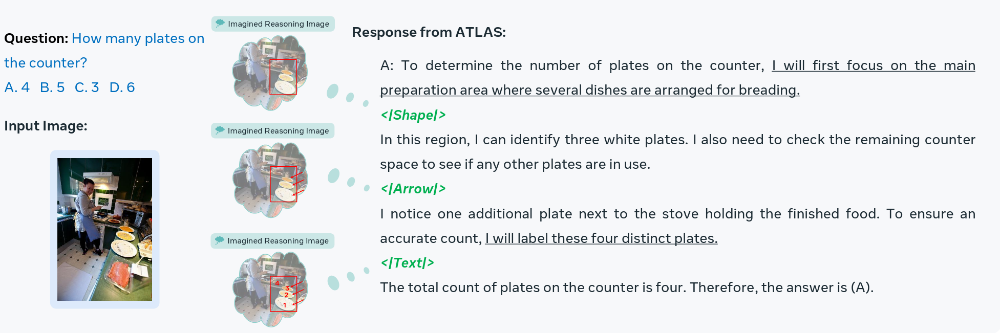
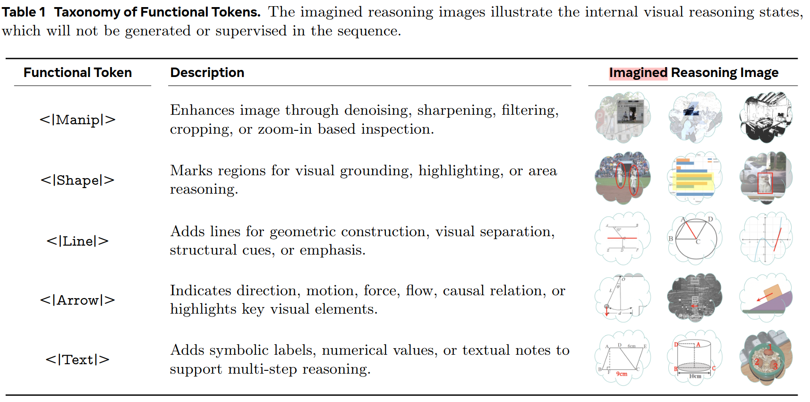
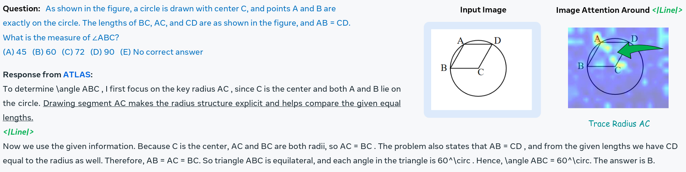

# ATLAS: Agentic or Latent Visual Reasoning? One Word is Enough for Both

- [project page](https://atlas-oneword.github.io/)

用特殊的 token 输出来辅助 visual reasoning。

对于 Language Space 下的 Reasoning，可以通过 `<thinking>xxxxx</thinking>` 的方式，用语言来“激活”思考过程，但是对于视觉上的推理，并没有类似的这么方便的东西。如果类比语言，那可能的方法或许包括

- 直接以图片的形式输出中间思考过程
- 输出一些语言形式，但是对应到图片空间的思考过程，例如文本格式输出 uv 坐标。
- 用第三方的 tool 来辅助思考过程，例如调用工具画辅助线，画完之后把绘制了辅助线的图像输入回来。
- 在另一个模态、另一个模型中完成思考，然后回到语言模态继续。

而本文的做法则激进得多。直接在语言空间里，用一个 token 的空间，让模型**假装思考**。

如上图，ATLAS 会在模型输出中插入 `<|Shape|>`, `<|Arrow|>`, `<|Text|>` 这样的 functional token，他们本身是确实新加到词表中的 token。这些 Token 是有限几种，且使用哪个 Token 取决于现在正在进行的任务。

模型添加的 functional token 包括

然后模型设计部分就结束了，ATLAS **并没有**做以下的事情

- 没有将这个 function token 重新接一个 output head，用其他 auxiliary task 来训练该 token 的 embedding
- 没有将该 token 设计成 learnable token，而是直接在词表中划了几个没用的词出来，人为赋予其含义。
- 没有真的在图像空间中框选、画箭头、加label，上图中的可视化仅仅是演示，实际上没有任何机制保证模型是在做这样的事情。

## Train

训练的目标是标准的 SFT + GRPO RL，只是在 RL 过程中，额外提高了 functional token 的 loss weight。

这样训练的效果可以看做两方面

- 训练模型正确回答问题。
- 训练模型正确使用 functional token。

而所谓的正确使用 functional token，指的就仅仅是，正确输出。和 functional token 是否思考了什么东西没关系。

文章对 functional token 的 attention map 做了可视化。

可以看出 functional token 确实激发了模型在特定时刻去思考图像信息。