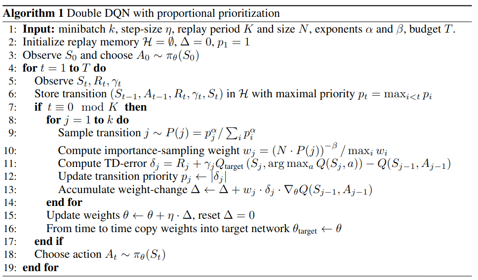

# Prioritized Experience Replay
[Blog PER](https://danieltakeshi.github.io/2019/07/14/per/)

- PER 保证效果不好的样本被更多次采样
- IS 则限制了梯度更新的幅度

> Here large steps can be very disruptive, because the first-order approximation of the gradient is only reliable locally, and have to be prevented with a smaller global step-size. In our approach instead, prioritization makes sure high-error transitions are seen many times, while the IS correction reduces the gradient magnitudes (and thus the effective step size in parameter space), and allowing the algorithm follow the curvature of highly non-linear optimization landscapes because the Taylor expansion is constantly re-approximated.

## Prioritized Experence Replay
优化 DQN 从 replay buffer 中 sample 的方法，简单说就是把 TD error 看作是 weight 来进行 sample。核心的作用是用更高的采样复杂度和更多的内存占用，来减小 experience data 的需求。

最直观的权重定义就是每个样本 $i$ 的 TD Error $p_i = |\delta_i|$。如果直接以此为优先级，构造优先级队列进行采样的话，会使得采样结果非常不稳定，且容易受到极值的影响。

理想的采样方法应该是
- 采样概率正比于 $p_i$
- 每个样本都会被采到

PER 定义的采样概率是 $P(i) = \frac{p_i^\alpha}{\sum_k p_k^\alpha}$
- $\alpha = 0$ 即为均匀采样，越大 priority 的影响越大，一般不超过 1。
- $p_i$ 给了两种定义方式
    - $p_i = |\delta_i| + \epsilon$，$\epsilon$ 保证采样概率不是 0
    - $p_i = \frac{1}{rank(i)}$，rank 指的是样本在按照 $|\delta|$ 排序的 replay memory 中的顺序。

## Importance Sampling Weights (IS)
PER 修改了样本的分布，原本 DQN 收敛的目标是
$$\text{minimize}_\theta \mathbb{E}_{(s_t, a_t, r_t, s_{t+1})\sim D}\left[\left(r+\gamma \max_{a\in \mathcal{A}}Q_{\theta^-}(s_{t+1}, a) - Q_\theta(s_t, a_t)\right)^2\right]$$

PER 破坏了 $(s_t, a_t, r_t, s_{t+1})\sim D$，Importance Sampling 旨在解决这个问题，即在更新网络参数的时候额外加一个权重 $w_i$，采样概率越高，参数更新越慢。

$$w_i = \left( \frac{1}{N}\cdot \frac{1}{P(i)} \right)^\beta$$

- $\beta$ 取 0-1，越大则对 PER 带来的分布变化的补偿越大。
- 实际应用时会对其除以 $\max_i w_i$ 来归一化。

最终的完整算法

## Implementation
[torchrl.data.PrioritizedReplayBuffer](https://pytorch.org/rl/reference/generated/torchrl.data.PrioritizedReplayBuffer.html)