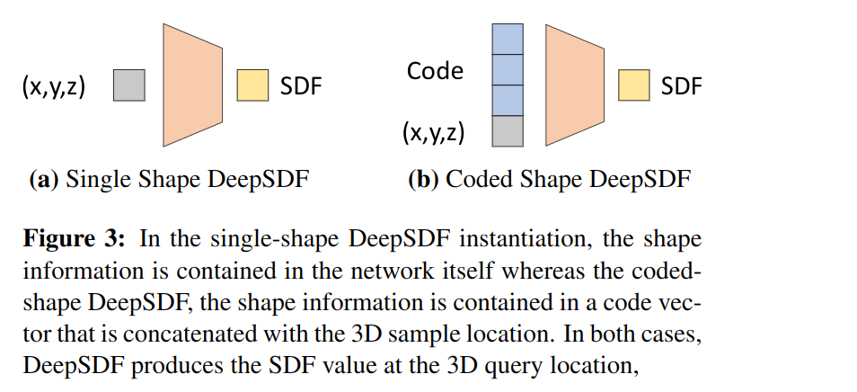
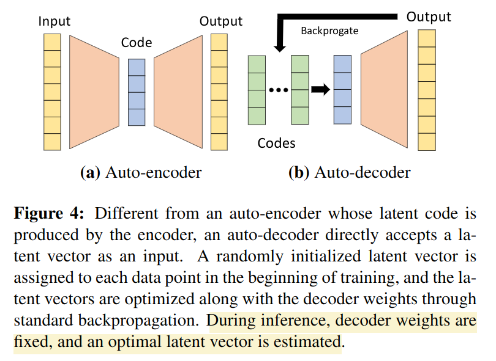

# DeepSDF: Learning Continuous Signed Distance Functions for Shape Representation
(1600 引用)

[github](https://github.com/facebookresearch/DeepSDF)

Represent SDFs via latent code-conditioned feed-forward decoder networks.

文章的方法不只局限于训练单个 3D shape，还可以训练一类 shape。即下图所示两种



第一种情况是一个简单的 MLP 网络。

第二种情况即对一类物体中每一个物体都训练一个 latent vector，本文最大的创新点在于对该表征不是用 encoder-decoder 网络来训练，而是直接使用一个 auto-decoder 网络。



具体来说
- 对于一个类型的物体组成的数据集 $X$，从中采样样本点 $x_j, s_j$，然后并不把 $x$ 作为输入，而是在训练阶段直接为每个不同的模型随机生成一个 $z_i$，把这个 latent vector $z_i$ 和 query $s_j$ 拼接作为模型输入。
- 模型输出 SDF 值。
- 直接用正常的反向传播训练网络，不同的是 $z_i$ 也是优化的变量。
- inference 的时候，固定模型参数，给定特定 SDF 值，计算
$$\hat{z} = \argmin_z \sum_{(x_j, s_j)\in X} \mathcal{L}(f_\theta(z,x_j), s_j) + \frac{1}{\sigma^2} \lVert z \rVert_2^2$$

## Implimentation
### Network
不同于一般的 torch 网络先构建然后在固定的网络上 forward，这里的 Network 的 forward 过程包含逻辑判断。

核心配置项：
- latent_size: latent space 的维度。(对应配置文件中的 "CodeLength")
- dims: 网络输出维度。需要注意的是，网络初始化时会首先`dims = [latent_size + 3] + dims + [1]`，即 `dims[0]` 为输入的尺寸，`dims[-1]` 为最后输出的 SDF 的维度 1，然后 `num_layers = len(dims)`
- dropout: index list，进行 dropout 操作的网络层的 index。
- norm_layers: 进行 normalization 操作的网络层的 index。
- latent_in: index list，在那些层的输入部分将 latent vector + xyz 输入，默认值为 `[4]`。这有点反直觉，看参数名字应该是 latent vector 的输入层，但实际上 xyz 也被输入了。另外 latent_in 不包含第 0 层，输入永远会在第 0 层输入一次。
- weight_norm: bool，是否对网络的参数进行 normalization。默认 `true`
- xyz_in_all: bool，是否在每一层输入的时候都把 xyz coordinate 输入。默认 `false`
- use_tanh: bool，是否在最后的输出层之前使用 tanh 激活函数。默认 `false`
- latent_dropout: bool，是否在第一层输入 latent vector 的时候直接进行 dropout，默认 `false`。

记 M=`num_layers`

网络构建
- 对第 0 到第 M-1 层网络
    - 如果下一层不属于 latent_in，那么输出维度即 `out_dim = dims[layer + 1]`，如果下一层属于 latent_in，那么输出维度为 `out_dim = dims[layer + 1] - dims[0]`。如果 xyz_in_all 那么输入维度还要减去 3
    - `self.lin#i = nn.Linear(dims[layer], out_dim)`
    - 如果该层属于 `norm_layers`，则加上 normalization，类型由 weight_norm 决定

Forward 过程
- 输入 input `N x (L + 3)`，假设网络一共有 M 层
- 如果需要对 latent vector 进行 dropout 则对 `input[0:-3]` 进行 dropout
- i 从 0 到 M-2 层
    - 如果该层为 `latent_in`，则将该层输入拼上 latent vector
    - 如果 `xyz_in_all`，则将该层输入拼上 xyz
    - 过 linear 层和 normalization 层 （weight_norm 或者 batch_norm）
    - M-2 层之前，过 ReLU 激活函数
    - 对要进行 dropout 的 layer 进行 dropout
    - 对于第 M-2 层，如果是 weight_norm 则过 weight_norm，如果是 batch_norm 则不进行 normalization。并且 M-2 层不进行 dropout
    - 对于第 M-2 层，如果要进行 tanh 则过 tanh 作为最后的输出层
- 第 M-1 层，实际上又是一个 tanh 层，看上去是个开发过程中遗留的 bug，实际上该层永远不会发生作用。


### Training
和一般的 Training 过程最大的差别在于 latent_vector 也是优化变量，所以 latent_vector 也需要时 torch 计算图的一部分，并且需要和 network weight 一起存下来。

latent_vector 被实现为 `torch.nn.Embedding`。

另外 optimizer 初始化的时候需要把 latent_vector 的参数也加进去。

```python
optimizer_all = torch.optim.Adam(
        [
            {
                "params": decoder.parameters(),
                "lr": lr_schedules[0].get_learning_rate(0),
            },
            {
                "params": lat_vecs.parameters(),
                "lr": lr_schedules[1].get_learning_rate(0),
            },
        ]
    )
```