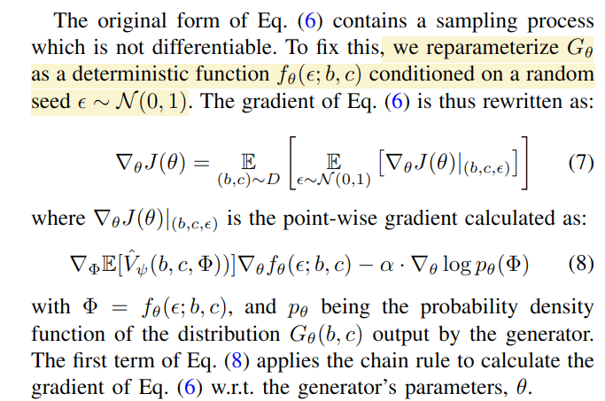

# MAGIC: Learning Macro-Actions for Online POMDP Planning

## POMDP
Partially Observable Markov Decision Process，是对 Markov Decision Process 的一个泛化。MDP 的基本假设是决策是根据 Observation 来的，但是 POMDP 假设 Observation 是不完整的。即 Observation 是对实际系统所处 State 的一个 Probability Observation Distribution。

这就要求解决一个 POMDP 系统的决策问题需要包含一个 Sensor Model，从 Partial Observation 中学到 Observation 分布，进而学到最优 Policy 的规律。

POMDP 更贴近现实中各类规划问题。

## Macro-Action
其实类似于 local trajectory，action sequence。

## DESPOT
解决 POMDP 的一个 RL 思路。（没太搞懂除了把 state 换成 belief 之外还有什么核心思想）

## MAGIC Algorithm
总体流程
- $\Phi = G_\theta(b,c)$，generator 根据当前的 belief $b$ 和 context $c$ 输出一个 micro action
- $m,v\sim \text{MACRO-DESPOT}(b,c,\Phi)$，使用 $\Phi$ 进行 plan，得到 macro action（action sequence）。planner 还会给出一个 value 值 $v$。这里的 MACRO-DESPOT 算法并不重要，Planner 本身是 non-differeitial 的。
- 执行 $m$ 得到新的 $b$
- 将 $(b,c,\Phi, v)$ 存到 replay buffer
- Repeat

### Critic Learning
Value Critic $\hat{V}_\psi(b, c, \Phi)$
- $b$：belief，partial observation or history of observations.
- $c$: context
- $\Phi$: micro action parameter

直接使用 replay buffer 中的 $(b, c, \Phi, v)$ 来训练，Value Critic 输出的是 Gaussian Distribution 的 $\mu,\sigma$，所以使用的是 [negative log likelihood loss](https://pytorch.org/docs/stable/generated/torch.nn.GaussianNLLLoss.html)，类似一个同时优化 $\sigma$ 的 MSE loss，[简单解释](https://stats.stackexchange.com/questions/521091/optimizing-gaussian-negative-log-likelihood)。

文中是写作了最大化 log-likelihood
$$J(\psi) = \mathbb{E}_{(b,c,\Phi,v)\sim D}[\log p_\psi(v)]$$

这里的 D 为 replay buffer。

### Generator Learning
Generator $\Phi\sim G_\theta(b,c)$。Generator 是 stochastic 的，其输出也是一个可以采样的分布。

目标是最大化

$$J(\theta)=\mathbb{E}_{(b,c)\sim D}\left[ \mathbb{E}_{\Phi\sim G_\theta(b,c)}[\hat{V}_\psi(b,c,\Phi)] + \alpha\mathcal{H}(G_\theta(b,c))\right]$$

由 $G_\theta$ 的输出采样得到 action $\Phi$，然后计算其 value critic estimation，用梯度回传更新 $\theta$，和 Actor-Critic 的更新方式一样。由于从 $G_\theta$ 采样的过程不可微，所以训练时使用了和 VAE 一样的 reparameterization trick。

<!---->

## Questions
- 如何定义 $G_\theta$ 的输出？是否必须也是分布形式？是否可以理解为任何 planner parameter，当然也可以是 planning result 本身。
- 网络结构
- 对于基于 NeRF 的 critic 和 generator 来说，由于没有 encode 的过程，是不是输出可以是 deterministic 的？最好仍然输出随机分布。
- 如何输出 action sequence?
- 将 target entropy 作为超参数在训练时调节。
