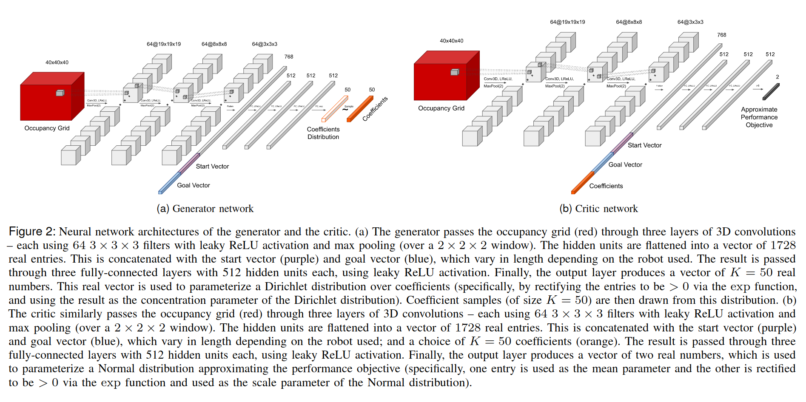

# Adaptive Experience Sampling for Motion Planningusing the Generator-Critic Framework
通过学习 sampling distribution 来辅助 planner，generator 输出的是 sampling distribution，和 planner 之间并不是 differential 的。

文章直接使用了 RRTConnect Planner。理论上任意 sampling based planner 都可以。

Generator 输出的是一个 Gaussian Mixture Model，Planner 给出几个 solution path，其中的每个 waypoint 都是一个采样中心，而 Generator 输出的是多个 path 的权重系数 $w=(w_1, ..., w_K)$。

Value Critic 的定义是 Planner 的 inner loop 执行次数（？？？？）。最终算法的目的是

