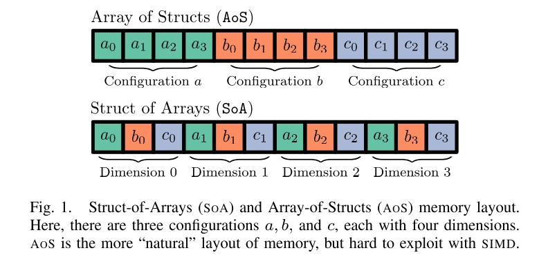
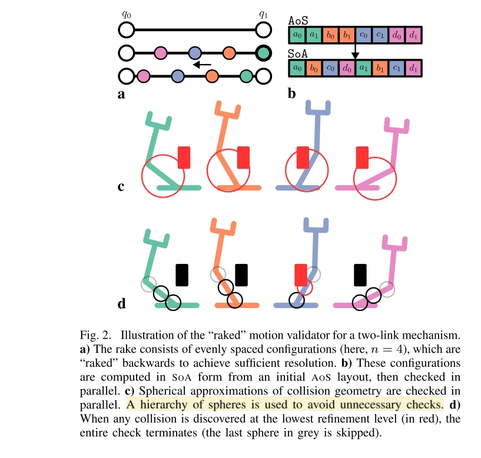

# Motions in Microseconds via Vectorized Sampling-Based Planning
以高度并行化的方式运行 sampling-based planner，在毫秒数量级的时间完成对 7-14 dof state space 的 planning。

核心的 Motivation 是通过将 sample based motion planning 的耗时缩短到几毫秒，从而能够在交互式场景、TAMP场景能够直接使用这些 planner。

## Method
sample based motion planner 通常包含以下几个 "primitive" operations
- 寻找 nearest neighbor
- state validity check
- local planner to grow edges
- edge velidity check

本文的核心改进就是将上述 operations 中的 forward kinematics 和 edge validity check 进行向量化和并行操作，文中称为 “Single Instruction/Multiple Data (SIMD)”。也正是由于本文的核心改进在 primitive operations 的优化上，其可以应用在不同的 sample based motion planner 中，而不用对 planner 的算法部分做大量修改。

## Vectorization & Parallelization

本文从两个方面入手来提升代码的并行度
- 并行化执行代码，这需要解决运算之间的依赖，互相有依赖的运算是不能并行化执行的。
- 向量化参数，这需要解决各类逻辑分支，如果有 `if (a[0]) {} else {}` 这样的语句，即使 `a` 本身向量化了，也不能对所有维度采用相同 operation，从而同样无法被 SIMD 指令执行。

为了做到并行化，本文实现的东西包括：
- 一套基于 Struct of Arrays (SoA) 的 vectorization 数据结构，用这套数据结构实现了例如 robot state，obstacles 等 motion plan 中的元素。
- 用于做并行 collision check 的 Collision-Affording Point Tree (CAPT) 
- 基于现代CPU的并行化指令集实现的高并行化代码，为此使用了一些可以 trace computation operation 的库，根据 trace 的结果来决定哪些操作之间有依赖，并编译并行化代码。

## Vectorized Forward Kinematics
> carrying out each operation in sequence, but on multiple configurations simultaneously

现有的 Forward Kinematics 普遍使用 Orocos Project （ICRA 2021, Open robot control software: the OROCOS project） 维护的 Kinematics and Dynamics Library (KDL) 。KDL 计算 Forward Kinematics 的方式是很难直接并行化的，有两个方面原因
- 计算之间相互依赖，例如后续 link 的 transformation 基于前面 link 的计算结果
- 逻辑分支的使用，例如多种 joint 类型。

本文的解决方案是用一个 tracing compiler 来对特定机器人的 Forward Kinematics 计算过程进行 trace，记录其所有操作和变量间依赖，从而自动化的构建 vector configuration structure 和使用其进行 forward kinematics 计算的 operations。（看起来类似 JIT）

tracing compiler 输入 URDF，输出 vector configuration structure 和 optimized machine code。

## Vectorized Collision Checking

- Shpere based representation: 机械臂简化为link上的一系列 sphere，障碍物也简化为不同的 primitive，最常见的是直接用 point cloud。看上去目前的实现是 point cloud 的环境
- Hierarchy of spheres: 如果更大的 sphere 发生了碰撞，则忽略后续。

## Vectorized Motion Validation
原本的 Motion Validation 采用的方法大都是将连续的 edge 离散成一系列 state 之后分别做 validation check.

本文加速 Motion Validation 的基本思路是
- 离散后的多个 states 同时 check validation
- 将 validation check 直接作为 forward kinematic computation 的一部分。由于 FK 的计算是需要先计算 parent link 才能计算 child link，在计算到 parent link 的时候如果已经发生了 collision，则后续 link 的 forward kinematic 也不计算了。

## Implementation
目前核心的 tracing compiler 并没有开源，但是提供了对部分机器人编译完之后的 cpp code。