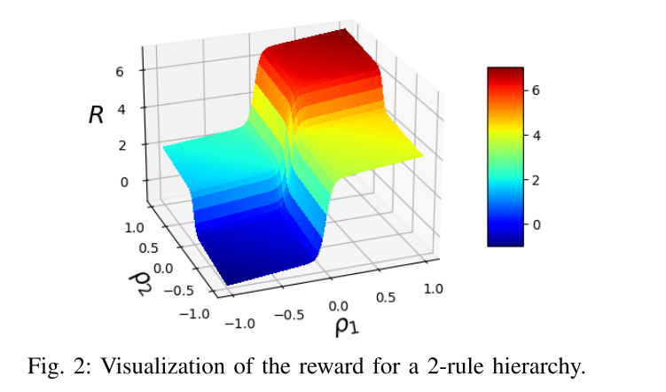

# Receding Horizon Planning with Rule Hierarchies for Autonomous Vehicles
combine critic 参考。

解决的问题：使用 differentiable reward 来做 planning 问题的时候，常遇到不同 reward 之间有优先级，例如避障和高效。但是简单的给 reward 加优先级会极大提升优化问题的复杂度（不太懂原因但是想想也是直接加优先级是一定不 work 的）。所以文中给出的方案还是一个“加权”的 reward （a “flat” differentiable reward function comprised of weighted contributions from all the rules），并且进一步说明他们的方案和直接设定优先级 hierarchies 的效果是一样的，或者说优先级可以等价为这里使用的 rank-preserving reward functions。

> Hence, the flat differentiable representation of hierarchies achieves the best of both worlds: the expressive power of hierarchies and the computational advantages of gradient- based optimization through modern optimization tools.

## Method
文章原始定义如下：
- 定义 rule $\phi: \mathcal{S}\times \mathcal{W}\rightarrow \{\text{True,False}\}$ 来衡量一个在场景 $\mathcal{W}$ 中的机器人 trajectory $x_{0:T}\in \mathcal{S}$ 是否满足某个条件。
- 定义 robustness $\hat{\rho}_i(x_{0:T},w) \in \mathbb{R}$ 来作为衡量 rule $\phi_i$ 是否满足的一个 metric （即 robustness 是 rule 的量化，并且是一个 estimation）
- 定义 hierarchy $\varphi \coloneqq \{\phi_i\}_{i=1}^N$ 为一个 rule list，定义了当前问题的不同 rule 的优先级关系，i越小优先级越高。
- 一个 hierarchy 的 robustness 可以表示由每个 rule 的 robustness 组成的 N 维向量 $\hat{\rho} = (\hat{\rho}_1,...,\hat{\rho}_N)$
- 剩下的工作就是把 vector $\hat{\rho}$ 映射到一个实数，这里分成两步
- 首先把每个向量 $\rho$ 映射为一个自然数 rank

  $$r(\rho)\coloneqq 2^N - \sum_{i=1}^N 2^{N-i} \text{step}(\rho_i)$$

  这里的 $\text{step}: \mathbb{R}\rightarrow\{0,1\}$ 把 robustness 值二值化，对于本文的 reward 定义，简单的把小于0的映射到0，大于0的映射到1。前面的 $2^{N-i}$ 是 $\rho_i$ 的 weight。最终得到的 rank $r$ 相当于把 N 维 0，1 vector 按照其2进制代表的数排了个序，二进制的第 $i$ 位就是 $1-\text{step}(\rho_{N-i})$，最终得到的 rank 数越小，代表满足的 rule 越多且其优先级越高。

- 然后根据这个 rank 设计一个 reward function，也就是 rank-preserving reward function，最终需要达到的效果是，最小化这个 reward function 的累计回报能够让 trajectory 的 rank $r\circ\hat{\rho}(x_{0:T}, w)$ 最小。
- 定义 rank-preserving reward function $R:\rho \mapsto R(\rho)\in \mathbb{R}$ 满足 $r(\rho) < r(\rho')\Longrightarrow R(\rho) > R(\rho')$

文中给出的第一种满足这些条件的 reward function 是

$$R(\rho) \coloneqq \sum_{i=1}^N(a^{N-i+1}\text{step}(\rho_i) + \frac{1}{N}\rho_i)$$

这个函数分为两部分，前面的 $a^{N-i+1}$ 通过添加一个指数常数，保证函数值随着优先级增大，对应 robustness 的 reward 指数增大。而后面的均值项则是为了应对 rank 相同的情况下，前面的指数项大小一样，那就优化均值项。

这里的 $a$ 与 $\rho$ 的大小有关，为了让两项处在一个数量级，也为了保证不同的 $\rho_i$ 在一个范围内。这里的 $a>2$，$\rho_i\in[-\frac{a}{2},\frac{a}{2}]$。

step function 并不是可微的，所以文中有给出了上述函数的可微版本

$$R(\rho)\coloneqq \sum_{i=1}^N (a^{N-i+1}\text{sigmoid}(c\rho_i) + \frac{1}{N}\rho_i)$$

原本的 step function 就是二值化函数，这里只是换成了 soft 的二值化，即 sigmoid。从这个角度看 c 就相当于控制了 sigmoid 的非线性程度。

## 在 state critic 和 collision critic 中使用
collision critic 很符合这里的形式，但是 state critic 本身是一个具体 cost 值。这里的 step 函数的一个核心就在于他是个二值化，即 rule 的满足与否，不满足的情况下则优先满足高优先级的 rule。但是 state critic 目前的定义是没有满足与否一说的。但是还是可以用的，因为即使考虑很差的情况，state critic 的 step 值恒定，依然可以保证 reward 的优先级，并且由于均值项的存在可以保证正常的最小化 state critic。

超参数设置：
- state critic 首先做归一化。由于并不知道 state critic 的取值范围，所以去一个大概的估计值 $m$，$v_s\leftarrow \text{cost}/m-\frac{1}{2}$。m 可以取 nearst state 和 sampled state 之间的最大 distance。
- a=2.01, c=30.