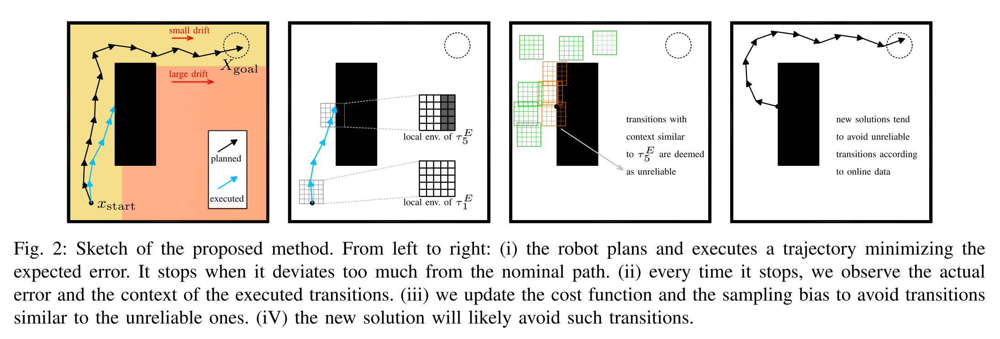

# Online Adaptation of Sampling-Based Motion Planning with Inaccurate Models

解决的核心问题是让模型在 Inaccurate 的环境中进行 Planning。

这里的 Inaccurate 是指进行完 perception 之后依然是 Inaccurate 的，比如建好 occupancy map 之后完成了 collision free 的 motion plan，但是实际执行的时候还是发生了碰撞，这时候怎么恢复 planning。

衡量算法效果是通过 `increases the success rate in execution and reduces the number of replannings needed to reach the goal.`

## Method
是在该作者23年工作 Motion planning as online learning: A multi-armed bandit approach to kinodynamic sampling-based planning 基础上做的

基本逻辑是，在 sample transition 的时候，能够 online 的衡量该 transition 与先前失败的（例如遇到unexpected collision）transition 之间的 similarity，然后修改 RRT-based planner 的 sample distribution。

## Question
- Task 本身真的有这个必要性吗？为啥执行 planned trajectory 会发生 drift
- Transition 之所以有相似性，是由场景设计决定的。