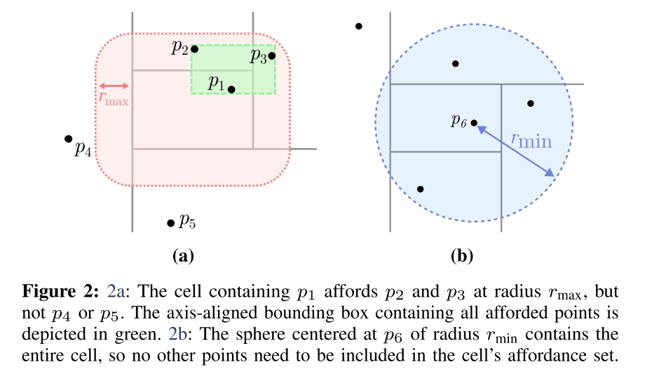

# Collision-Affording Point Trees: SIMD-Amenable Nearest Neighbors for Fast Collision Checking

CAPT Paper. The collision checker used by [VAMP](./[2023%20Arxiv]%20Motions%20in%20Microseconds%20via%20Vectorized%20Sampling-Based%20Planning.md).

Task: Collision check between **spheres** and point cloud. 

本文通过使用专门的数据结构和 SIMD 指令集，做到对上千 points 的场景 10ns 级别的查询速度。同时，本文并没有对 point cloud 之间的距离的计算做近似，而是直接计算准确的距离，这和一些用近似 primitive model 来代替场景的方法有所区分。
除此之外本文还提供了 point cloud filting algorithm 从而减少 points 数量。

## Collision-Affording Point Tree
思路来自于用 k-d (k-dimensional) tree 表示空间数据。传统用的最广泛的是八叉树 Octree。如果是 sphere 与 OcTree 做 collision check，通常的做法是
- OcTree 的每个 leaf node 代表一个 obstacle point 或者一个 free area.
- 先计算 sphere 在 OcTree 中所处的 node
- 按照 sphere 的半径，取这个半径范围内的所有 node，查看是否有 collision。
  - 核心操作是计算 sphere 所在 node 的 nearest neighbor nodes，方法是找 OcTree 临近节点，如果还没有 collision 并且还在 radius 内，则继续找父节点和父节点的临近节点。

直接使用 kd tree 做 collision checking 面临以下问题
- memory access。对于 SIMD 指令来说，希望计算只依赖于 vector 内的数据，而不是计算过程中决定是哪些数据。这会直接影响到 cpu cache 的效率。而 kd tree 并没有对 memory layout 做限制，random memory access 是 cache-unfriendly 的。
- conditional-branch-heavy backtracking recursive algorithm. 这指的主要是计算 collision 时需要频繁进行的对 point (tree leaf) 求 nearest neighbors 的操作，这时候往往需要递归的寻找上级节点。这样的操作对于并行化时十分不友好的，因为不同的 point 所索引的节点时完全不同的。

为了解决以上两个痛点，CAPT 一方面对 memory layout 进行了专门设计，另一方面 leaf node 不再是单个 point，而是一个 affordance set，这个 set 中包含了粗略的节点的 nearest neighbors。

### Heap-like Memory Layout
Heap (Binary Heap) 是极其常用的一种数据结构，他是对 tree 的一种 array 表示，array index 可以粗略的看作是对 tree 进行 BFS 时的访问顺序。

对于二进制计算机，对 binary heap 中父节点子节点的访问可以通过移位操作实现，而对临节点的访问则直接就是相邻元素，因此效率极高。binary heap 的最常见的应用时 priority queue，实际上 heap 和 priority queue 已经成为了同义词。

一个常见的 Max-Heap 如下图所示。

本文的 Collision-Affording Point Tree 也是使用了类似的数据结构，从而能够获得连续的内存，能够通过最简单的 cache 策略（cache 临近 address）就把一条 SIMD 指令所使用的内存 load 到 CPU Cache 中。(是的文章直接引用了 1964 年的 HeapSort 论文)

本文对三维空间的离散化和 OcTree 是一致的，但是 OcTree 每个节点有 8 （$2^3$）个子节点，为了用 HeapLike Memory Layout （Eytzinger layout）来存储 OcTree Like Datastructure，本文在进行空间划分的时候，先按照 X-axis 分成两部分（seperate by Y-Z plane），每一部分是 binary tree 的一个 branch，然后按照 Y-axis, Z-axis 做同样的划分，这样一个 resolution level 就可以用 binary tree 中的 3 level 来表示。文章原本表述如下：

> Each branch of the tree partitions $R^k$ about an
axis-aligned hyperplane: a branch at depth d in the tree with test value t partitions the space such that, for any point $p \in PC$, if $p[d mod k] ≤ t$ (where $p[i]$ is the i-dimension component of p), it belongs to the left sub-tree of the branch; otherwise, it belongs to the right sub-tree.

k-d tree 本身效率就很高了，构建 k-d tree 的时间复杂度为 $O(kn\log n)$，查询 neighest node 的复杂度为 $O(\log n)$.

### Affordance Set
CAPT 的 leaf node 中包含的信息不是单个节点，而是该位置的 Affordance Set。

对于 CAPT 上的 leaf node 对应的 cell $c$，如果有一个 point $p$，他和 $c$ 中和他距离最近的点 $q\in c$ 之间的距离 $\lVert p-q\rVert\leq r$，则称 $c$ affords $p$ at radius $r$。

每个 cell $c$ 在某个 $r$ 范围内的所有 afforded points 称为这个 cell 的 affordance set，即上图 2.a 红色范围内的所有点。需要注意的是红色范围并不是个 cube，也不是个 sphere，而是由球心位于 cell 内的所有半径为 $r_{max}$ 的 sphere 所涵盖的区域。

2.a 中的绿色范围则是一个 axis-aligned bounding box，即能够包含所有 affordance set points 的最小 bounding box，在空间上是一个 k-d cube。

### Construct CAPT
构建过程的目标是找到所有 leaf cell 的 affordance set。本文的构建算法做了进一步简化，找到的并不是精确的 affordance set，但是可以保证 collision check 的正确性。

构建算法借鉴了 QuickSelect 算法
> QuickSelect: 找 N 个元素中第 K 大的元素，方法是先随便选一个 pivot element，把剩下的所有元素分成比 pivot 小和比 pivot 大两部分，然后根据两部分的元素数量和 K 比较，决定在哪一部分元素继续迭代这个过程。时间复杂度最差情况下是 $O(n)$

points padding: 首先将 points 数量补全到 power of 2，不是2的幂的情况下填充一堆互相之间距离为 $\infty$ 的 points。由于构建过程关心中位数的计算，所以不会影响数值计算。

- Initialize 
  - `PC`: All k-d points. `n=#PC`
  - `c`: cell represent the whole $R^k$。cell 的表示方式可以是 2k 个表示范围的最大最小值，初始化为 `{-inf, +inf, -inf, +inf, -inf, +inf}`
  - `z`: empty affordance set
  - `(T,A,P)`: 是用来存储结果的数据结构，`T` 是一个长度为 `n-1` 1D array，`A` 是图 2.a 里面画的绿色 bounding box，`P` 存储每个 cell 的 affordance set。
  - `i`: 0, 是 `T` 的index，也是 Tree Node 的 BFS index。
  - `d`: 0, `d mod k` 是当前针对的 axis，按照这个 axis 把 `PC` 分成 **数量相等的** 两部分
- `Construct(PC, c, z, (T,A,P), i, d)`, global `r_min, r_max`
  - `if #PC > 1 then`
    - $T_i \leftarrow \text{median}(p[d\mod k]), p\in PC$，即所有 points 在第 d 维的中位数。
    - $B_1 \leftarrow \{p\in PC: p[d\mod k]\leq T_i \}$
    - $B_2 \leftarrow \{p\in PC: p[d\mod k]> T_i \}$。由于对 points 数量进行了 padding，所以 $B_1,B_2$ 中 points 数量是相同的。
    - $c_1,c_2\leftarrow c$，将整个 cell 也分成两部分。举例：假设 $k=2$，$i,d=0$，原本 c 是整个空间 `c={-inf,+inf,-inf,+inf}`，按照第0维中位数 `T_0` 划分成两部分 `c1={-inf,T0,-inf,+inf}`, `c2={T0,+inf,-inf,+inf}`
    - $z_1 \leftarrow \{p\in z\cup B_2 : c_1 \text{~~affords~~} p \text{~~at~~} r_\text{max}\}$
    - $z_2 \leftarrow \{p\in z\cup B_1 : c_2 \text{~~affords~~} p \text{~~at~~} r_\text{max}\}$，$z_1$, $z_2$ 就是 $c_1,c_2$ 在 $r_\text{max}$ 下的 affordance set。需要注意的是 $z,c$ 都是中间变量，不会存到 $A,P$ 中，只有 leaf cell 和 affordance set of leaf cell 才会在 `else branch` 中存到数据结构中。
    - `Construct(PC, c, z, (T,A,P), i, d)`
  - `else`，即 `#PC=1`，由于 points padding，不会出现 `#PC=0`
    - 此时，有：
      - `PC` 中只有一个 point `x`
      - `c` 是 finest cell，其内部只有 `x`。需要注意的是 cell 的大小是不确定的。
      - `z` 是 `c` 在 `rmax` 下的 affordance set，它可能包含了周围很多个 cell 中的 points，甚至不限于相邻 cell。
      - `d` 不一定是哪个纬度，没有影响。
    - `x = PC[0]`
    - if $\exist q\in c: \lVert q-x > r_{min} \rVert$ then
      - $PC\leftarrow PC\cup z$，即如果 `c` 太大了，以至于 collision check 的时候，即使 sphere 就位于 `i` 这个 cell，也不能保证就会发生 collision。这会影响到把哪些 points 看作是 affordance set，参见图 2.b
    - $a\leftarrow$ Bounding box of PC.
    - `P.append(PC)`，把 c 的 affordance set 存下来。在 `c` 很小的时候，小到 `x` 到边界的距离比最小的 sphere 还小，此时 affordance 中只有 `x`，否则，affordance set 包含了所有 `rmax` 下的 affordance set。这个原理在后面 collision check 时候再讨论。
    - `A.append(a)`，把 affordance set 对应的 minimum bounding box 存下来。

## Collision Check
`CollisionCheck((T,A,P), x, r)`，`(T,A,P)` 为前面构建的 CAPT，`x` 是球心，`r` 是半径。
- 找到 `x` 对应的 Tree index `i`，方法是与 `T` 中元素做 `log(n)` 次比较。
- 此时对应的 bounding box 为 $A_{i-n+1}$，计算 `x` 和 bounding box 之间的距离，如果大于 $r$，则可以确定 collision free，`return false`
- 与 $P_{i-n+1}$ 中所有 points 做 collision check。由于这是 `rmax` 下的 affordance set，所以发生 collision 的 points 只可能在这些 points 中。前面构建过程中，如果 `c` 非常小，以至于其中 point 到 `c` 边界的距离比 `rmin` 还要小，此时 affordance set 中只有 point 自己，事实上此时由于 shpere 的半径比 `rmin` 要大，已经可以确定会发生 collision 了，只不过为了并行化，这里还是会与唯一的 point 做一次 collision check。

## Ideas
- Nearest neighbor states 也可以用类似的数据结构实现 SIMD 指令查询。