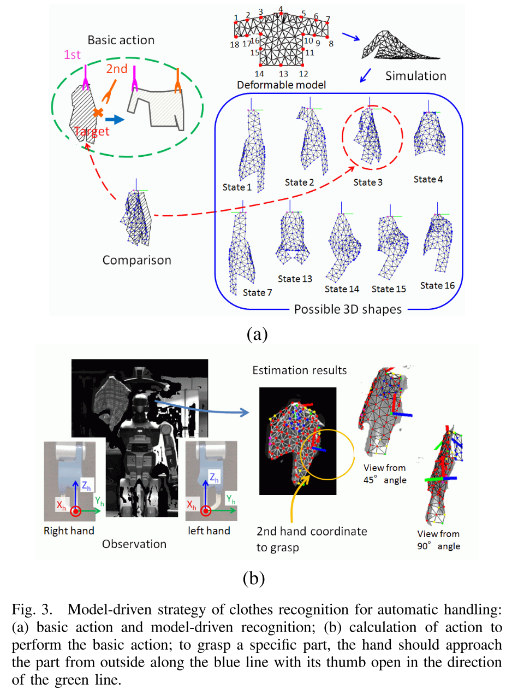

# Clothes handling based on recognition by strategic observation
文章设定的任务是 re-grasping，将衣服提起，然后识别其姿态之后用双臂将其在提起的状态下展开。

首先需要识别衣物被提起之后的 state，采用的方法是将 simulation 作为 template 来进行模式匹配，最接近的 simulation state 被看作是 correct state。

