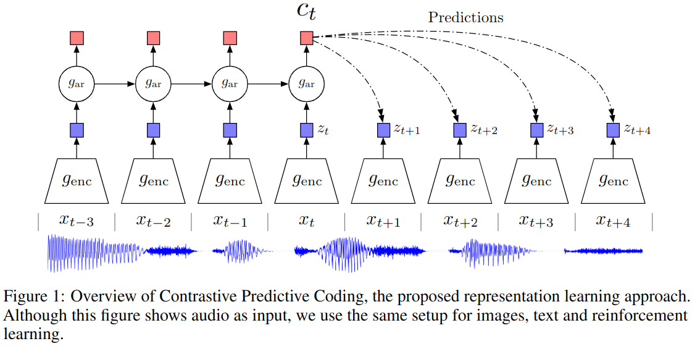

# Representation Learning with Contrastive Predictive Coding

- [知乎对比学习文章](https://zhuanlan.zhihu.com/p/346686467)
- [知乎：理解Contrastive Predictive Coding和NCE Loss](https://zhuanlan.zhihu.com/p/129076690)
- [StackOverflow: Intuitive explanation of Noise Contrastive Estimation (NCE) loss?](https://datascience.stackexchange.com/questions/13216/intuitive-explanation-of-noise-contrastive-estimation-nce-loss)

## About NCE
- [知乎：NCE 到 InfoNCE](https://zhuanlan.zhihu.com/p/334772391)

Noise Contrastive Estimation (噪声对比估计)，本身是在 NLP 领域提出来的方法。

NLP 的 n-gram 模型，将每个句子看作是单词序列 $s=\{w_1, w_2, ..., w_m\}$ ，语言模型就是把句子看作是每个单词出现的概率 $p(w_1, ..., w_m)$。单词出现的概率实际上是一个基于上下文 （context $c$）的条件概率：

$$
\begin{aligned}
p(w_1,...,w_m) &= p(w_1) * p(w_2|w_1) * p(w_3|w_1, w_2)...p(w_m| w_1 ... w_{m-1})\\
&=\prod_{i=1}^m p(w_i|w_1,...,w_{i-1})\\
&=\prod_{i=1}^m p(w_i|c_i)
\end{aligned}
$$

马尔科夫假设认为一个单词出现的概率仅与其前面的有限个词有关，所以模型简化为

$$
p(w_1,...,w_m)  = \prod_{i=1}^m p(w_i | w_{i-n+1},...,w_{i-1})
$$

如果模型学到了每个单词对不同上下文的条件概率 $p(w|c)$，就可以得到不同句子出现的概率。而对于机器学习来说，需要将这个学习任务建模成最大似然估计问题，即找到合适的目标函数，能够反映 n-gram 模型。

最直观的建模方法是从定义出发，模型是 $w$ 和 $c$ 的函数，输出 $p(w|c)$，那么对应的对数似然函数为

$$
\mathcal{L}_{MLE} = \sum_{w_i\in s} \log p_\theta(w_i | c_i)
$$

然后求正确的参数 $\theta$ 使得样本的似然函数最大。此时的模型也就是 $w,c$ 的函数 $F(w,c;\theta)$。

按照上述建模，可以建立神经网络，以句子某个位置的 context $c_i$ 为输入，最后一层经过 softmax 函数得到向量 $\hat{y} = [\hat{y}_{i,1},..., \hat{y}_{i,|V|}]$ ，其中 $\hat{y}_{i,j}$ 代表下一个单词是单词库中 $v_j$ 的概率，也就是 $p_\theta(w_i = v_j | c_i)$。

将这个模型 softmax 层之前的得分定义为 $s_\theta(w,c)$，该得分可以衡量 $w$ 在 context $c$ 中的匹配性，那么条件概率可以表示为

$$
\begin{aligned}
p_\theta(w|c) &= \frac{\exp(s_\theta(w,c))}{\sum_{w'\in V}\exp(s_\theta(w',c))}\\
&=\frac{u_\theta(w,c)}{Z(c)}
\end{aligned}
$$

但是当单词库 $|V|$ 非常大时，上述模型并不能实际使用。在实际的神经网络模型中，最大化似然函数的常见方法是训练一个多分类器，网络如果可以输出每个单词的分类置信度，求和也就是这里的 $Z(c)$，但这实际是做不到的。

NCE 就是为了解决这一点提出的。最简单的 NCE 形式可以理解为，输入一对单词，要求模型解决一个二分类问题，如果一对单词属于同一个 context 则输出 true，否则输出 false，以此来训练 word embedding。

而可以证明，通过训练这个简单的二分类器，得到的网络参数 $\theta$ 可以用来表示句子中单词的分布 $p_\theta(w,c)$。换句话说，可以证明对上面的二分类器的目标函数最小化，等价于对 n-grame 模型作最大似然估计（但是这个证明看不懂）

## InfoNCE
把 NCE 的思想用到信息论中。解决的问题和 NCE 一样，“通过五监督学习来得到高为数据的特征表示”，而且本文是采用“预测任务”来作为无监督学习的任务。

InfoNCE 的基本想法：最大化当前上下文 $c_t$ 和未来数据 $x_{t+k}$ 之间的互信息来构建预测任务。