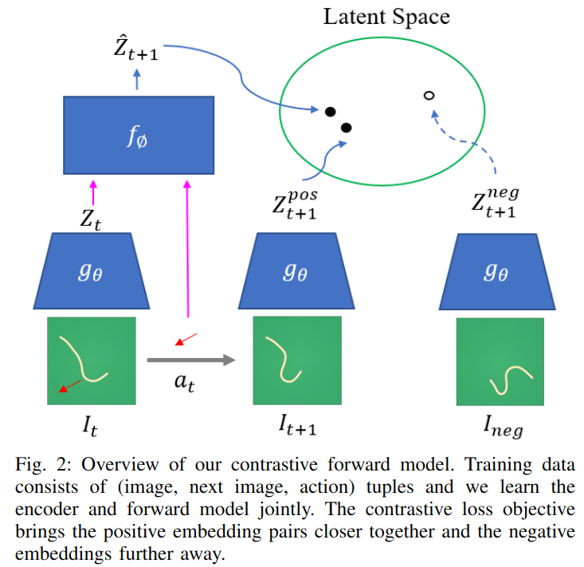

# Learning Predictive Representations for Deformable Objects Using Contrastive Estimation
CFM （Contrastive Forward Modeling）

核心想法是用对比学习来直接在 latent space 学习 deformable objects 的 dynamic model。任务场景仍然是展开衣服或者绳子这样的不包含语义的任务。

## Contrastive Forward Modeling

