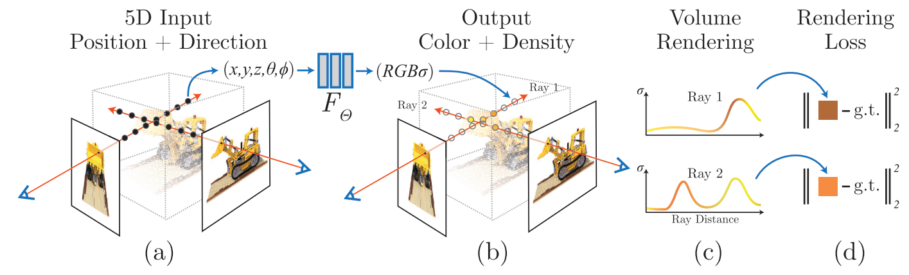

# NeRF: Representing Scenes as Neural Radiance Fields for View Synthesis
在不进行3D重建的基础上，使用静态场景的多视角图像训练一个全连接网络，使其可以输入一个 3D 坐标值和一个视角方向，输出从该位置该视角观察该坐标得到的 radiance(辐射率)，从而完成该视角的图像渲染。

在这里一个静态场景不再是用一个3D模型表示，而是用一个连续函数（MPL 网络）表示。函数输入 3D location $\text{x}=(x,y,z)$和观察角度 $(\theta, \phi)$，输出 emitted color $\text{c} = (r,g,b)$ 和 volume density $\sigma$。

## Model

模型本身只包含上图的 (a)(b)，即输入 5D vector，输出用于体渲染的 density 和 color。

另外，由于 volume density $\sigma$ 理论上只和坐标有关，和观察角度无关，所以在 encode 过程中将坐标和角度分开 encode。

- 坐标先通过八个全连接层，直接输出一个 volume density $\sigma$ 和一个 256 维的 feature
- 256 维的 feature 和观察角度拼接之后，再过更多全连接层输出颜色。

## Volume Rendering with Radiance Fields
Volume Rendering 总体渲染方程：
$$C(\mathbf{r}) = \int_{t_n}^{t_f} T(t) \sigma(\mathbf{r}(t))c(r(t), \mathbf{d})dt$$
- $r(t) = \mathbf{o} + t\mathbf{d}$: 视线，是一条从视点 $\mathbf{o}$ 向视线方向 $\mathbf{d}$ 的射线。
- $t, t_n, t_f$: $t$ 即视线的参数，$t_n<t\leq t_f$ 限定了渲染的范围。
- $\sigma$: volume density，可以理解为 “遮挡发生的概率密度”，即从 $t_n$ 到一个位置 $t$，发生遮挡的次数的分布为 $\int_{t_n}^t\sigma(r(t))dt$，这即为发生遮挡次数的期望。记$\int_{t_n}^t\sigma(r(t))dt=\lambda$，从位置 $t$ 到视点发生 $k$ 次遮挡的概率就满足泊松分布 $P(k) = \frac{\lambda^k}{k!}e^{-\lambda}$。
- $T(t) = e^{-\int_{t_n}^t\sigma(r(s))ds}$: 光线透过率，即光线从视点到$t$没有遇到任何遮挡的概率，即上面提到的 $P(0)$
- $c(r(t), d)$: 从视点观察该位置的颜色。
- $C(r)$: 渲染结果。

接下来需要构建渲染过程的离散近似，并且保证渲染仍然是可微的，因为需要将渲染结果和 ground truth 之间的距离作为 loss 来优化得到颜色和 density 的网络。