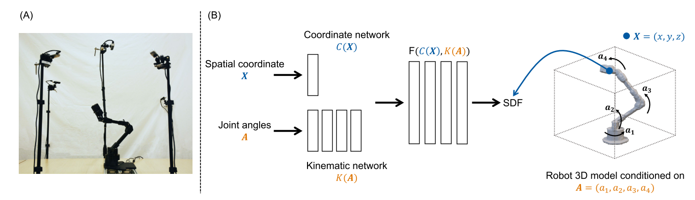

# Full-Body Visual Self-Modeling of Robot Morphologies
用 NeRF 的思想，用神经网络表示机器人形态。

模型以点云和 joint angles 为输入，输出一个 SDF （Signed Distance Function）。其中点云数据是融合了多个视角的深度相机数据。

$$SDF = \{\mathbf{X}\in\mathbb{R}^3, A\in\mathbb{R}^N | F(C(X), K(A))\}$$

**如何训练？？？**

C(X) 为提取 point cloud feature 的网络，K(A) 为提取 Joint Feature 的网络，将 feature 拼接后

当有了这个模型之后，就可以把这个模型直接作为 kinematic model 来求解简单的 motion plan 问题。

## Motion Plan
本文所求解的 motion plan 问题包括：
- 用 robot body 触及一个物体
- 用 end effector 触及一个物体
- 在避障的限制下用 end effector 触及一个物体

整个模型的输出是一个 SDF，所以“触及”对应着在该位置上模型输出的 SDF 值为 0。

### 用 robot body 触及一个物体
在训练过程中，输入的点云是机械臂自己的点云，相当于

## 点云输入是必要的吗？
看上去并不是必要的。

理论上，只需要一个从 Joint Angle 到 SDF 的函数 $F(X, A) = Distance$，输入一个 Joint Angle 和一个坐标值，模型输出该位置到 robot 的距离。这样需要解决 “触及一个物体的时候”，相当于 Distance=0，X=物体位置，求解 A。