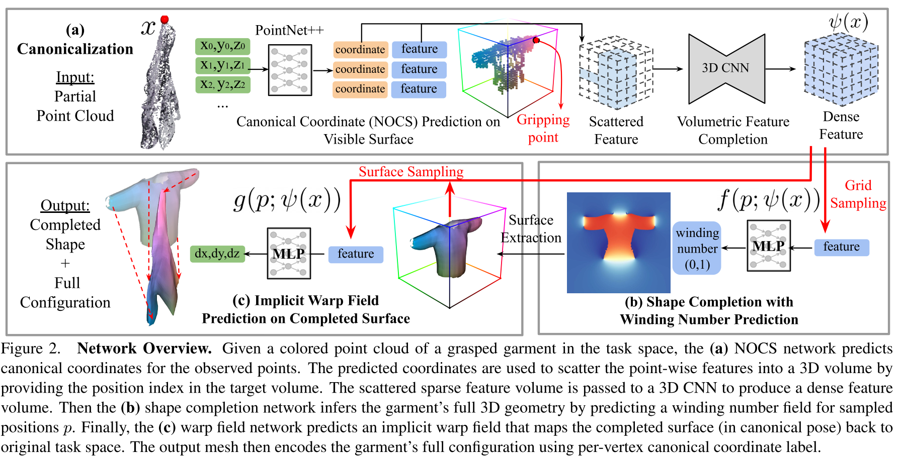

# GarmentNets: Category-Level Pose Estimation for Garments via Canonical Space Shape Complemention
对每种类型的衣服，用 Winding Number Field (WNF) 构建其正则化的表示（canonical space）。然后对于衣服的稀疏化的点云，用一个映射网络将其中的每个点映射到 canonical space，并在该空间中补全完整的衣服。将补全后的衣服映射回原本的观测空间，就的到了衣服完整的 mesh。

最终的输入输出是，输入任意姿态下某件衣服的稀疏点云，输出一个完整的 3D mesh，以及其每个顶点在 canonical space 中的坐标。其中 canonical space 中的坐标是包含语义信息的，例如同一类衣物的不同部位。

## Canonical Space
定义方式并不是唯一的，只需要保证对于同一件物体有确定的值即可，以及在同一类物体中有一定的一致性。

本文用的是将衣物摆成 T-Pose 并缩放到 [0,1] 坐标值之后的 3D 坐标作为 Canonical Space。其中缩放系数每一类衣物时固定的。

## Canonical Coordinate Predication
用一个 PointNet++，输入 partial 点云，输出其在 Canonical Space 中的坐标值。

比较独特的在于，本文并没有将坐标估计建模成坐标值的回归问题，而是将每个坐标轴上的坐标值划分成 64 份，对每一个点云中的点，分类其在三个坐标轴上属于哪一份，用分类问题来解决其坐标值。

## Feature Scattering

## Shape Completion
现有的工作中，3D重建一般是 TSDF 表示 （例如 DynamicFusion）。本文中 Shape 则是通过 WNF 来表示的。

Completion 的方法是训练一个 Neural Implicit Representation 的 MLP 网络，输入 Feature Scattering 部分得到的 feature $\psi(x)$ 和 query 的坐标 $q$，输出坐标的 WNF 值

$$w(q) = f(q;\psi(x))$$

WNF 值同样用于监督训练 Feature Scattering 部分的 3D CNN。