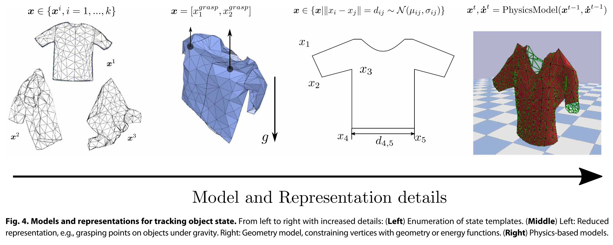

# Modeling, learning, perception, and control methods for deformable object manipulation

## Perception
Perception 的最核心问题是对柔性物体的 state 有一个合适的定义。对于 rigid object 来说 state 可以简单的定义成 6D Pose/Velocity。但是对于 deformable object 并没有通用的定义形式。

如果已经有了合适的定义，那么 state estimation 问题可以表述为优化问题

$$
\begin{aligned}
x^* &= \argmin\lVert o-\mathbf{M}(x)\rVert\\
x&\in\text{ObjectStates}    
\end{aligned}
$$

### Representation and State Estimation

#### Template-based
以已有的数据，例如图片、模型数据为模板，来表示当前某个变形物体的状态。这是对 state 的一种定性(qualitative)表示。

例如 [Clothes handling based on recognition by strategic observation](./2011%20Clothes%20handling%20based%20on%20recognition%20by%20strategic%20observation.md) 就直接用的 simulation 作为 state，找到和当前观测值最接近的 simulation state 作为状态表示。

为了实现与 template 的匹配，可以计算 vertex 之间的距离一类的。

#### Geometric Models
#### Physics-based Models
通常就是指在 manipulation 一类过程中加入模拟器作为 model，这种情况一半是假设模型已知，而不会实时重建。

### Parameter Identification
也是 perception 的重要任务，一般是通过 interactive perception 来识别一些关键的形变参数。