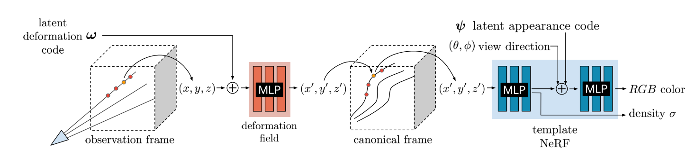

# Nerfies: Deformable Neural Radiance Fields
从普通的照片和视频中重建可变形场景。

文章并不强调 deformable，而是强调可以学习到一个不依赖于精确标定，只需要通过手机拍摄的视频就可以完成场景重建。重建的对象主要是人物模型。

文中的 deformable 指的是多帧输入可能并不是对一个 static scene，例如这里的人物模型重建，人在采集过程中是可能动的。

## Observation-to-canonical deformation
回顾对 static scene 的 NeRF，输入的 query $(x,y,z,\theta,\phi)$ 都是在同一个 frame 下的，不同视角观察同一个点得到的颜色和density是相同的。

但是在本文中，没有对场景的 static 假设，并且没有相机标定，这意味着
- 不同 view 之间的 mapping 关系不是先验的。
- 即使知道不同 view 之间的 frame transformation 关系，两个 view 观察同一个点得到的 color & density 也是不同的，因为场景是动的。

为了解决这点，文章先假设存在这样一个 frame，从不同的 view 的 query $(x_i, y_i, z_i)$ 可以对应到该 frame 中的同一个 $(x',y',z')$。文章将这个 frame 称为 canonical frame。

为了得到这个 canonical frame，每个 view $i$ 都有一个映射函数
$$T(x, \omega_i) = x'$$

将该 view 下的座标 $x$ 映射到 canonical frame 中的座标 $x'$，不同 view 下观察同一个点将映射到同一个 $x'$。

这里的 $\omega_i$ 相当于对 view frame 的一个隐式编码，文中称为 latent deformation code，而这个隐式编码也是通过学习获得的。

除此之外，由于图片不再是体渲染获得，而是直接用相机拍到的，那么在拍摄过程中就不能保证不同视角的曝光、白平衡等相同，所以还要有一个 appearance latent code $\psi_i$，作为每个视角的额外渲染参数。