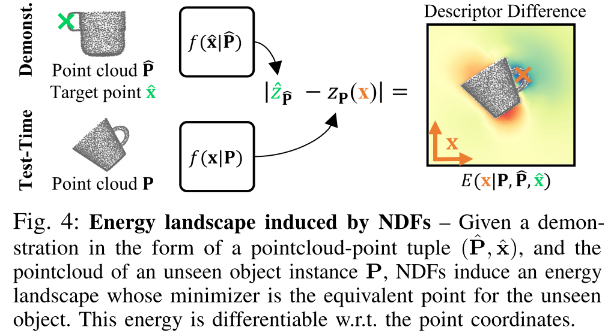
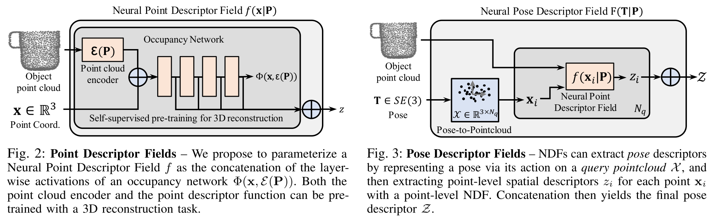

# Neural Descriptor Fields: SE(3)-Equivariant Object Representations for Manipulation
是一个基于 demonstration 的 manipulation 方法。

隐式表达已经被证明可以编码物体的形状、视觉信息，但是这些信息并不包含 task-revelant 的信息。通常情况下的 data-driven demonstration 的方法需要大量的关于 configuration 的 demonstration，而本文希望直接把物体中与 task 有关的信息通过隐式表达来表示，从而通过 query 该隐式表达完成 task。而该隐式表达的监督信息是从 demonstration 获得的。

## Neural Point Descriptor Fields
简单说是一个 Encoder，但是定义比较奇葩。encoder 的训练直接借用了 [Occupancy Network](./2019%20Occupancy%20Networks%20Learning%203D%20Reconstruction%20in%20Function%20Space.md)，即网络本身的定义是

$$\Phi(\mathbf{x}, \varepsilon(\mathbf{P})): \mathbb{R}^3\times\mathbb{R}^k\rightarrow [0,1]$$

其中 $\varepsilon$ 是 encoder 网络。$\Phi$ 是 occupancy 网络。

而 Point Descriptor Field 定义则是将 $\Phi$ 网络每个激活函数层的输出的 concatenate:

$$f(\mathbf{x|P}) = \bigoplus_{i=1}^L \Phi^i(\mathbf{x, \varepsilon(P)})$$

这里的 $\bigoplus$ 代表向量拼接，$i$ 为第 $i$ 个激活函数层，$x$ 是 query 的坐标值，P 是模型点云数据。

文章的基本想法是，在 demonstration 过程中，机械臂操作物体的时候会有特定的操作位置，例如抓取位置、悬挂位置 之类。这些位置就是后续使用 Point Descriptor Field 时候 query 的坐标点。然后文章希望对于同一类型的物体来说，使用 Occupancy 监督训练得到的 $\Phi$，其不同激活函数层的输出可以包含一个点相对于整个模型位置的完整信息。而同一类型的物体，包含同样语义的点（抓点、悬挂点）应当有相近的 Descriptor Field 值。如下图所示：

文章直接将前面定义的 Point Descriptor 之间的距离作为衡量语义距离的依据。例如上图中，给出一个 demonstration，其模型为 $\hat{P}$，抓点为 $\hat{x}$。现在给出一个新的模型 $P$，要求算出对应的抓点 $\bar{x}$，则计算方法为最小化以下能量项

$$\bar{x} = \argmin_x E(x|\bar{P}, P, \bar{x}) = \lVert f(\hat{x}|\hat{P} - f(x|P)) \rVert$$

由于 $f$ 是一个可微的连续函数，所以上述最小化可以通过 fix 网络参数的情况下梯度下降一类的方法求解。

## Neural Pose Descriptor Field
上面的 Neural Point Descriptor 解决了怎么编码 Point 的相似性，从而可以求解同一类物体不同 instance 的相似部位。

这里用同样的思路来描述 Pose 之间的相似性。

这里直接利用三个（或者更多个点）$\mathcal{X}_h$来表征一个 pose，然后目的是找到一个正确的姿态 $Tx$。那就可以用类似的方法最小化能量来做到这点。

对于一个 demonstration 中的物体$\hat{P}$ 和姿态 $\hat{T}$ (也就是转换矩阵)，他对应的 Pose Descriptor 定义以及最小化方式如下所示。

$$\begin{aligned}
    \mathcal{Z}=F(T|P)=\bigoplus_{x_i\in\mathcal{X}_h}f(Tx_i|P)\\
    \bar{T} = \argmin_T\lVert F(T|P) - F(\hat{T}|\hat{P})\rVert
\end{aligned}$$

Interactive Fusion