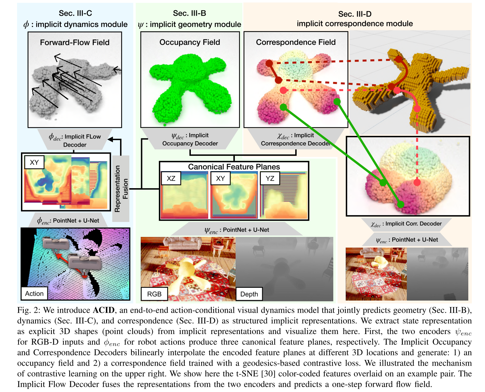

# ACID: Action-Conditional Implicit Visual Dynamics for Deformable Object Manipulation
操作并且规划对可变形物体。

整个网络可以分为三个部分
- State Representation
- State Transition
- State Distance Measurement

## State Representation
直接用了 [Convolution Occupancy Network](./2020%20Convolutional%20Occupancy%20Network.md)。

首先输入一张 RGBD 图片，由一个 Observation Encoder 将图片映射到特征空间 $\psi_{end}:\mathcal{O}\rightarrow \mathbb{R}^{H\times W\times D}$。映射的方式是，首先将 RGBD 图反投影到 3D，用 PointNet 得到 feature 并将 feature 投影到三个平面，得到三个 2D feature map。然后过 U-Net 得到三个 128x128x64 的 feature（？？HOW）。

下一步需要从 feature 中 decode 到 occupancy probability。给定一个座标 $p\in \mathbb{R}^3$，对三个 feature map 中对应位置的 feature 进行一个插值和求和，输入一个 MLP，输出 $[0,1]$ 的 occupancy probability。

$$\psi_{dec}(p, \psi_{enc}(o_t)|_p)\in[0,1]$$

有了这两部分之后，实现从 RGBD 图片中获取完整的几何信息。

$$s_t = \{p\in\mathbb{R}^3|\psi_{dec}(p, \psi_{enc}(o_t)|_p > \tau\}\in \mathbb{R}^3$$

## State Transition
目的是得到 action-conditioned dynamics $\phi:\mathcal{S}\times\mathcal{A}\rightarrow\mathcal{S}$。

实现方式也是用了类似的 encode-decode 结构，用 flow 来作为监督信息。

## Planning
target 是以目标状态的 RGBD 图片给出的，即给出的是 $o_{0},o_{target}$。

然后下一步希望得到 action sequence 的 cost $\text{cost}(a_1,...,a_n)$。