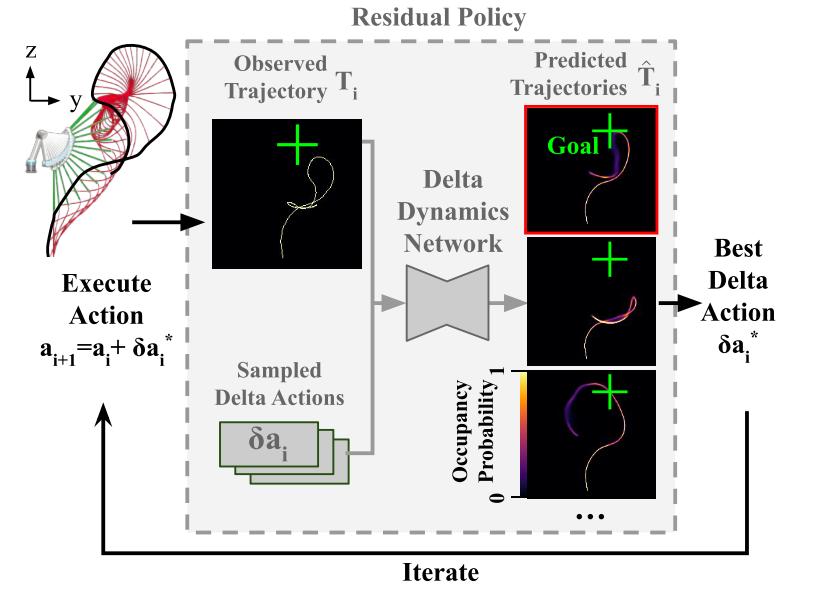

# Iterative Residual Policy for Goal-Conditioned Dynamic Manipulation of Deformable Objects
任务场景是那些可重复尝试的、goal 可以衡量的任务。

最基本的想法是，不再关心完整的 dynamic model，而只关心 delta dynamics。即在执行一次尝试之后，能够学到 delta action 对应的影响，然后通过适当的 action sampling 方法快速的逼近目标。

文章使用的两个示例任务是将绳子甩到特定目标，以及将布料展开到特定 pose。

使用 delta action/dynamic 最大的能力在于泛化性，可以在 sim 环境中做 action sampling ，而将对应的结果直接用在 real 中。这是因为虽然 sim 和 real 的完整 trajectory 存在巨大 gap，但是其 delta action 产生的影响是相对一致的。

Limitation：文章的实验场景比较理想和简单，有简洁的 trajectory / goal distance / action space 定义。而实际操作一个未标定物体的话，上述三个放面的参数都不会这么简洁。

## Method
总体流程
- 采取某个 action $a_i$，得到对应的 trajectory $T_i$
- 采样一堆 delta action $\delta a_i$，用训练的 Iterative Residual Policy 输出每个 delta action 对应的结果 $\hat{T}_i$
- 选择最接近 goal 的 $\delta a_i$
- repeat

### Delta Dynamics Network
输入：$T_i$，$\delta a_i^j$
输出：$\hat{T}_i^j$

Trajectory 是由图片表示的，文中的实验场景都是在二维平面中运动（Y-Z平面，也就是基座不转甩机械臂），所以 trajectory 可以直接用 Y-Z 平面上一条线表示。文中将 trajectory 的 occupancy probability 用 pixel value 表示，作为 trajectory 数据格式。对于多个 keypoint 的，把每个 keypoint 作为图片的一个通道的数据。

Action 也是用图片一样的维度输入，方法是对于 $N_a$ 维的 action $\delta a_i$，直接转变成 $N_a$ 个 channel 的图片拼在 trajectory 后面。