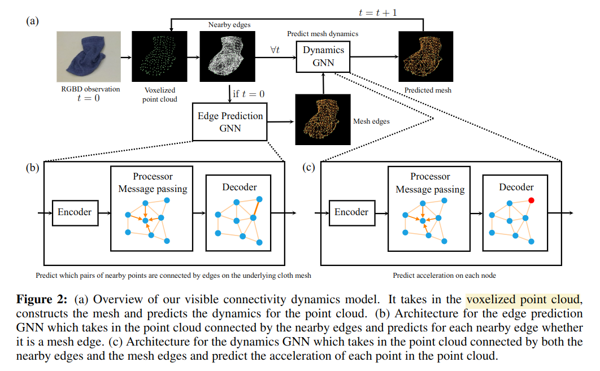

# Learning Visible Connectivity Dynamics for Cloth Smoothing

VCD paper

任务场景是将一团杂揉的衣服铺展开。

方法的核心是将物体建模成 Graph，而不追求对物体的重建。只关心在当前 partial 的观测下，能够看到的 particle 之间的 dynamic 关系是怎样的，移动一个 particle 会如何影响其他 particle。

**这种建模方式也决定了方法能够解决“铺开衣服”这种任务，但是并不能解决带有语义的任务，例如挪动特定部位，摆成特定 pose**

## Graph Representation
简单说文章将 observation 转变成一个图，每个 point cloud 中的点是一个顶点，相邻的顶点之间初始化了一堆边。这些边可能代表两种含义：
- 两个 point 之间是相连的
- 两个 point 之间不相连，但是距离很近发生了 collision

为了区分边是那一种，文章用 GNN 对边进行了二分类。

另外，文章对观测数据进行了预处理，将深度图得到的 point cloud 放到 voxel 中，再用 voxel 中心作为实际的数据点，这样可以保证初始化边用的距离参数不随数据改变，也可以减小 simulation 和 real 之间的 gap。

## Dynamics
一样的思想，在得到 graph 之后，把每个点的 dynamic state 也放在 node 中，然后用 GNN 预测下个时间片的 acceleration。文章将其称之为 Visible Connectivity Dynamics (VCD).

## VCD with Graph Imitation Learning