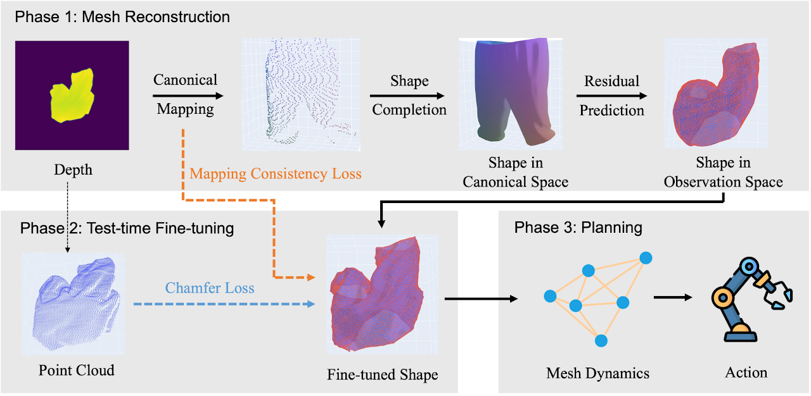

# Mesh-based Dynamics with Occlusion Reasoning for Cloth Manipulation
[website](https://sites.google.com/view/occlusion-reason/home)

**本文并没有在 manipulation 过程中进行 fine-tuning，而是对单帧深度图像，通过 fine-tuning 得到精细模型，然后 offline 的用 random shooting 作 planning。**

任务场景是将叠起来的衣服展开。

首先从单帧深度图中重建出衣服的 model，然后根据 mesh based dynamics 来进行规划和操作。

核心想法是，在操作过程中细化对衣服的重建，并且细化过程是 self-supervised 的。

## Pose Estimation
对 GarmentNets 进行了改进。

本文使用的输入是但个顶部视角的深度图像，而不是多视角融合的点云。所以使用的提取 feature 的网络不再是 PointNet++，而是 HRNet（一个CNN网络）。剩下的重建过程文章没有细说，应该和 GarmentNets 是一致的。

得到重建的 mesh 之后，通过两个 self-supervised 的 loss 来进一步细化模型。

### Unidirectional Chamfer Loss
Chamfer distance 可以衡量两个集合之间的距离

$$d_{CD}(S_1, S_2) = \sum_{x\in S_1} \min_{y\in S_2} \lVert x-y\rVert_2^2 +  \sum_{y\in S_s} \min_{x\in S_1} \lVert x-y\rVert_2^2 $$

简单说就是，计算$S_1$ 中每个点与 $S_2$ 中与其最近的点的距离的平方，以及 $S_2$ 中每个点与 $S_1$ 中与其最近的点的距离的平方，求和。Chamfer Distance 可以很直观的衡量两个集合之间的差别。

但是直接最小化 Chamfer Distance 会导致 estimation mesh 集中到没有被遮挡的一侧，从而导致错误结果。所以文章使用的是经过修改的 unidirectional Chamfer loss:

$$
\mathcal{L_C}(\tilde{V}^t; P^t) = \frac{1}{|P^t|}\sum_{p_i\in P^t} \min_{\tilde{v}_j\in\tilde{V}^t} d(p_i, \tilde{v}_j)
$$
- $P^t$ 是深度图像得到的 point cloud observation
- $\tilde{V}^t$ 是重建的 mesh estimation 的顶点
- $d$ 计算距离

即，只计算了单向的 Chamfer Loss，可以保证 predication 需要支持 observation，同时不需要对遮挡负责。

### Mapping Consistency Loss
GarmentNets 的总体过程是：
- 用 local frame 估计 canonical frame - 通过 PointNet++
- 在 canonical frame 提取 feature（其中包含 local frame 信息） 估计 WNF - 通过 3D CNN
- 使用 WNF，在 canonical frame 作 complementation - MLP，用 Neural Implicit Network 来 Query WNF
- 学习补完后的模型到 local frame 的转换 - MLP

整个流程中，坐标点先是计算到对应的 canonical frame coordinate，然后在转变回 local frame。Mapping Consistency Loss 限定，同一个点的输入和最终的估计输出需要是尽可能一致的

$$
\mathcal{L_M}(P^t) = \frac{1}{|P^t|}\sum_{p_i\in P^t} d(g(f(p_i)), p_i)
$$

## Dynamic Model
用 GNN 作 Dynamic Model，用 random shooting 作为 planning algorithm.