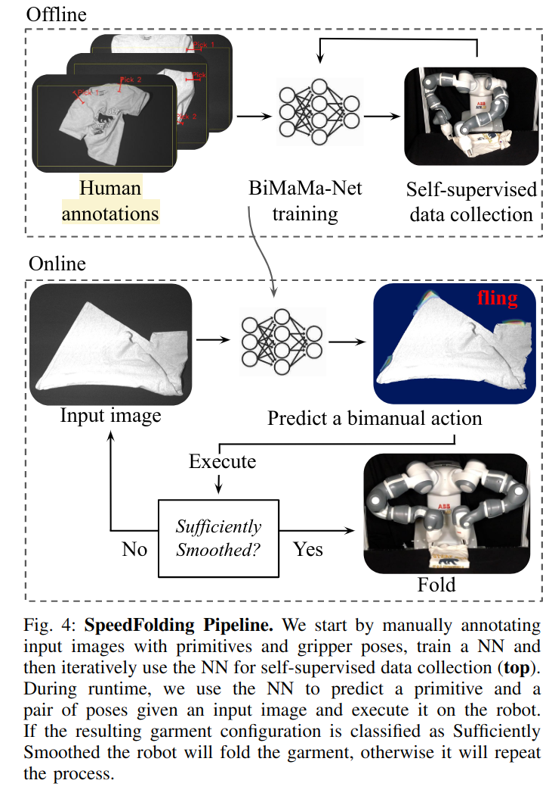

# SpeedFolding: Learning Efficient Bimanual Folding of Garments
有监督学习来学叠衣服，任务场景是用双臂机器人将衣服先摊平，然后折叠。

核心点：
- input space, action space 是在一个空间内的。
- 用 reward 来作为监督的非强化学习。

<!---->

## Input
直接以 top 视角的深度图和灰度图作为输入，而非3D数据。

## Action
文章对机械臂的 action 进行了简化，

$$a_t = \langle m, (x_1, y_1, \theta_1), (x_2, y_2, \theta_2) \rangle$$

这里的 m 是操作类型，包括 fling, pick and place, drag, fold, move。1，2对应两个机械臂，$x,y$ 是在 pixel coordinate 中的位置（直接对应 feature map 中的像素），$\theta$ 为夹爪旋转角度。

所有操作仅仅由一个 action 值确定。例如 fling，指的是抓住 a 中的两个位置，提起来到一定高度，互相远离拉动直到一定的反作用力，然后从前往后铺到平面上。drag 指的是抓住两个位置，向着远离 mask 中心的方向拖动。

## Supervisor
用 reward 来监督。即，从 2D 数据 encode 到的 feature map 直接代表了以该点为抓点采取某个 action primitive 的时候能够获得的 reward 期望。

feature map 是多 head 多 channel 的，每个 action primitive 有自己的 decoder，每个 $\theta$ 有自己的 channel。

实际执行操作之后会有相应的 reward，对于摊平衣服的任务来说，该 reward 由衣服的折叠程度、平滑程度计算而来。其中，平滑程度也是由一个单独的 sufficiently smoothed head 输出的。

$$r_t = \max\{\tanh[\alpha(cov(s_{t+1})- cov(s_t)) + \beta(p(smoothed|s_{t+1}) - p(smoothed|s_{t}))], 0 \}$$

reward 被保证是正的。

loss 文章里没有说，但是代码里用的是类似
```python
loss_fling = self.bce(pred_fling, reward * fling_heatmap, weights=fling_weight)
loss_pick = self.bce(pred_pick, reward * pick_heatmap, weights=pick_weight)
loss_place = self.bce(pred_place, reward * place_heatmap, weights=place_weight)
```

也就是说直接用 $r_t\times \text{heatmap}$ 作为 target 算 BCE Loss。这样只要出现了正的 reward，BCE Loss 会引导模型对能够获取高 reward 值的区域得到更高的 reward 预测值。

## Implementation
