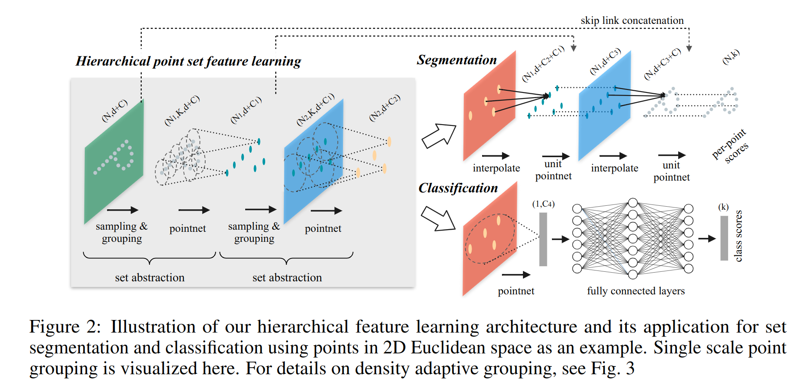

# PointNet
Point Cloud 数据的特点：
- 无序性，因此网络需要对不同顺序的输入保持不变性。
- 点之间的关联性，数据点之间是有空间上的关联性的，网络需要能够分析基于 distance metric 的 local structure
- 仿射不变性。网络应当对 point cloud 整体的 transformation 保持不变性。

## Architecture

上图中 n 是 point cloud 中点的数量，每个点的输入数据是三维坐标，所以输入的维度是 $n\times 3$。

## PointNet++
解决的核心矛盾就是 PointNet 没有提取 local feature。

解决方法就是按照欧式距离分成局部的 partition，对每一个 partition 过 PointNet，并且对这些 pointnet share parameters(类比卷积核)。

Set Abstraction: 将输入的点云样本减少到更少的样本数。输入数据维度为 $N\times(d+C)$，N 是点云数量，d 是坐标维度，C 是额外 feature。输出 $N'\times(d+C')$，即得到更少的点和不同的 feature。
  - Sampling layer: 用 FPS（Farthest point sampling） 算法 找到相隔较远的一部分中心点。输出为 $N'\times d$，即数量为 $N'$ 的中心点和他们的坐标。
  - Grouping Layer: 对每个中心点，找到其紧邻的 K 个点组成 group，输出为 $N'\times K\times (d+C)$。由于点云密度分布不均匀，这里的 K 可以不是个定值。由于后面的 PointNet 提取的是 Point-wise Feature 然后做 global pooling，所以不是定值没有影响。实际实现中，采用的方法是找到中心点一定半径范围内的所有点，同时对点的数量上限作限制。（所以即使输入非常 dense 的点云，也会在这里被 downsample 掉）
  - PointNet Layer: 对每一个 group 的 $K\times (d+C)$ 过 PointNet 输出一个特征向量 $C'$，然后接上中心点坐标，最后输出是 $N'\times(d+C')$。这里的 PointNet 之间是 share pointer 的。另外，输入的时候会把点的坐标减去中心点坐标，即用 local frame。

Set Abstraction 可以作为一个模块迭代调用。

