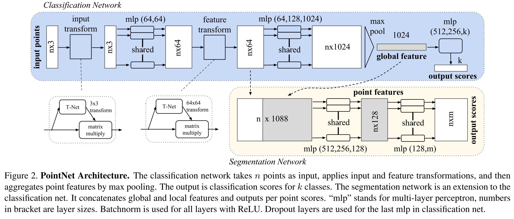

# PointNet
Point Cloud 数据的特点：
- 无序性，因此网络需要对不同顺序的输入保持不变性。
- 点之间的关联性，数据点之间是有空间上的关联性的，网络需要能够分析基于 distance metric 的 local structure
- 仿射不变性。网络应当对 point cloud 整体的 transformation 保持不变性。

## Architecture

上图中 n 是 point cloud 中点的数量，每个点的输入数据是三维坐标，所以输入的维度是 $n\times 3$。
