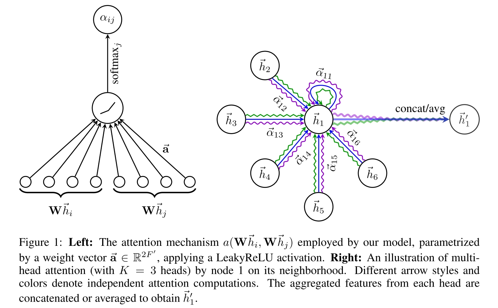

# Graph Attention Networks
在 graph 的 neighbor 之间用 attention layer，即一个用 transformer like network 处理 graph data 的通用方法。

## Graph Attention Layer

输入 N 个 node 的 F-dimension features, 输出这 N 个 node 的新的 F'-dimension features。这个结果和 transformer 中的 self-attention 是一样的，但是使用的方法更简单。

- 输入 node features 为 $h=\{h_1, h_2, ..., h_N\}, h_i\in \mathbb{R}^F$
- 将所有 feature 经过同一个 learnable linear transformation $W\in \mathbb{R}^{F'\times F}$ 映射到 F' 维。这个过程类似与 transformer 用 metrics 网络计算每个输入 token 的 Q,K,V 向量。只不过这里没有区分 QKV，而是用同一个向量
- 计算每一个 node i 与其 neighbor nodes 的 attention coefficient $e_{ij} = a(Wh_i, Wh_j)$，这里的 $a\in R^{2F'}$ 直接作用于拼接的两个 F' 向量。
- 对所有 node i 的 neighbor nodes 用上述流程计算 $e_{ij}$，通过 softmax 做归一化。
  $$\alpha_{ij} = \frac{\exp(\text{LeakyReLU}(a^T[Wh_i\Vert Wh_j]))}{\sum_{k\in \mathcal{N_i}}\exp(\text{LeakyReLU}(a^T[Wh_i\Vert Wh_k]))}$$
  计算得来的 $\alpha_{ij}$ 即看作 i 对 j 的 normalized attention coefficient，或者说 attention score。这里的 $\Vert$ 代表 concatenation。
- 用 $\alpha$ 作为权重计算所有 neighbor nodes 的 linear combination 作为 node i 的最终 feature。另外可以采用 multi-head method 使用多个 W, a 计算多种不同的 attention，最终得到的新的 feature 为
  $$h_i' = \Vert_{k=1}^K\sigma(\sum_{j\in\mathcal{N_i}}\alpha_{ij}^kW^kh_j)$$
  除了 concatenation ，multi-head feature 也可以用 average 合成一个
  $$h_i' = \sigma(\frac{1}{K}\sum_{k=1}^K\sum_{j\in\mathcal{N_i}}\alpha_{ij}^kW^kh_j)$$
  这里的 $\sigma$ 原文说是一个 nonlinear function，个人理解相当于 transformer 中的 feed forward 部分。

## Questions
看上去并没有比 Transformer 多东西，可以考虑直接对 neighbor nodes 应用 transformer 的 self attention