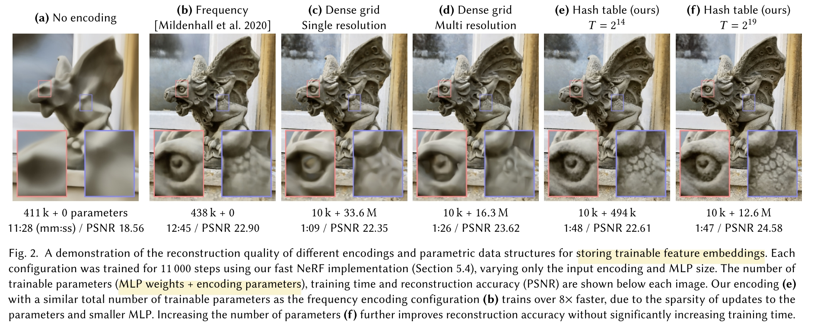
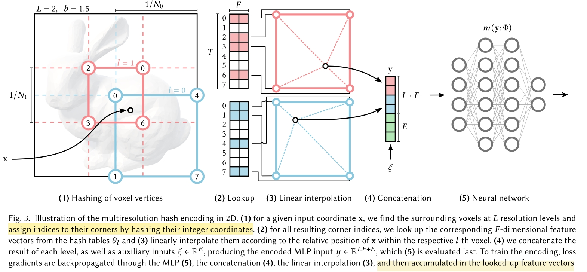
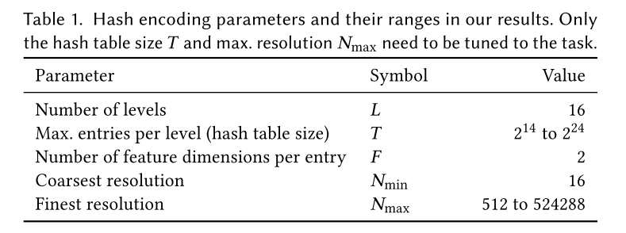

# Instant neural graphics primitives with a multiresolution hash encoding
- [github: Instant NGP](https://github.com/NVlabs/instant-ngp)
- [github: HashNeRF-pytorch](https://github.com/yashbhalgat/HashNeRF-pytorch)

Nvidia 出的快速构建隐式表达场景的方案，几秒钟就可以完成对 NeRF 的粗略 encoding。

方案总体上来说，是除了网络参数（weight & bias）以外，对输入空间进行进一步的参数化(input encoding)，用 hash table 减小输入空间尺寸，加快收敛速度。这种策略可以用于训练各种 graphics primitives，文中用的包括图片、SDF、NeRF。

算法的核心在于 hash algorithm 以及 forward 方式。

文章对算法的总结
> We reduce this cost with a versatile new input encoding that permits the use of a smaller network without sacrificing quality, thus significantly reducing the number of floating point and memory access operations: a small neural network is augmented by a multiresolution hash table of trainable feature vectors whose values are op- timized through stochastic gradient descent.

## Input Encoding Algorithm
Input encoding 本身有许多方法，最直接的方式是将 input 经过一个连续函数映射到另一个空间，类似 position encoding。文章将这种方法称为 frequency encoding (大概是因为连续函数通常是一堆周期函数的组合，类似 SIREN Network)。

更进一步的 input encoding 方案文中称作 Parametric encodings。在 Instant NGP 之前，已经有许多工作将额外的 trainable parameters (feature vector) 和一些数据结构结合。例如一个 grid，任意 sample 的 feature vector 为当前 sample 在 grid 中周围节点的线性插值，当训练的时候，只更新参与插值的 feature vector。其核心思路是
- feature vector 是 trainable 的，所以是一种自适应的 encoding algorithm
- 可以极大减小 MLP 网络的尺寸，加快收敛速度，还不影响最终效果

不同 Input Encoding 的效果

这里的 (a) 效果很接近我们目前遇到的问题，即只能学到一个大体分布。

上述 Parametric Encoding 的方法可能是我们最直接可以借鉴的。

## Hash Encoding Algorithm

本质上是对 Parametric Encoding 方法的一个延申，只不过不使用 grid 这样 dense 的数据结构来关联 feature vector，而是使用一个离散化的 hash table，好处是不需要关注场景的几何信息。并且并不会处理 hash collision，而是期望网络自己学会这种 collision。

- 算法包含两类网络，graphics primitives neural network $m(y; \Phi)$，以及 encoding network $y=\text{enc}(x; \theta)$。
- $\theta$ 其实就是一堆 feature vector，并且分为了 L 个不同的级别（resolution level），每个 level 有 T 个 维度为 F 的 feature vector。
- 每个 level 的 feature vector 数量被设计为一个等比数列，其公比 $b\in[1.26,2]$
- 给出一个 d 维的输入 $x\in \mathbb{R}^d$（文中没提但 x 应该是经过 normalize 的 ），在 level $l$，resolution 为 $N_l$。这个 resolution 指的是在每一个维度上“分辨率”，换句话说如果不做 hash，那么可以看作是一个包含 $N_l^d$ 个高维 voxel 的 dense grid。
- 计算 $x$ 在 $N_l$ 分辨率下的 corner 坐标 $\lfloor x_l\rfloor\coloneqq \lfloor x\cdot N_l\rfloor$, $\lceil x_l\rceil\coloneqq \lceil x\cdot N_l\rceil$，这样在 $\lfloor x_l\rfloor$ 和 $\lceil x_l\rceil$之间有 $2^d$ 个超体素。
- $N_l^d$ 在分辨率高的时候太大了，所以将每个 level 的所有 feature vector 存到一个长度为 T 的 hash table 中。当然如果 $(N_l + 1)^d \leq T$，那就全存下来。
- 文中使用的 hash function 为
$$h(x) = \left(\bigoplus_{i=1}^d x_i\pi_i\right) \text{ mod } T$$
这里的 $\oplus$ 是 bit-wise xor，$\pi$ 是一个随机数。
- 根据 $x$ 在 hypercube 中的位置，将其每个 corner 的 index 经过 hash function 之后，找到 hash table 中的 vector，然后做插值。对于 hash collision 则完全不处理，如果发生了 collision 那就映射到同一个 entry，让网络自己学会怎么区分。
- 对每个 level 重复这个过程，如果有 auxiliary input $\xi\in \mathbb{R}^E$，例如 NeRF 里面的 view direction，那么对其单独进行一次上述过程。最后所有 interpolated feature vector 拼起来作为后续MLP的输入 $y\in\mathbb{R}^{LF+E}$

文章使用的超参数如下

table size 和 number of levels 都比较大，这也是 instant ngp 能够得到高精度效果的原因，也是速度优化的核心。instant ngp 把 hash 等操作都用 cuda 实现并且高度并行化，所以才能几秒钟完成粗略训练。

## Implementation