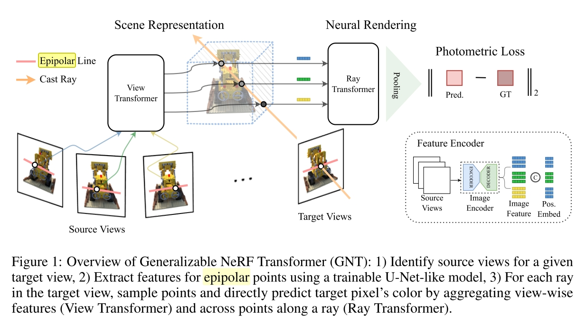

# Is Attention All That NeRF Needs
Generalizable NeRF Transformer (GNT)

文章的核心想法是将 volume rendering 的过程替换成一个 learnable rendering。NeRF 原本使用的 volume rendering 本质上是一个认为定义的渲染方程，而这个渲染方程有充当了 target image 和 input 之间关键的 map function 角色。这其实并不是一个通用的方法，因为 volume rendering 本身的表现能力是有限的，最终却期望学到精确的图片渲染结果。

文章自己对 contribution 的核心总结：
> Overall, our combined Generalizable NeRF Transformer (GNT) demonstrates that many of the inductive biases that were thought necessary for view synthesis (e.g. persistent 3D model, hard-coded rendering equation) can be replaced with attention/transformer mechanisms.

另外该文章的方法还可以避免为每个场景重新训练 NeRF (???)

本文并不是第一个用 attention 来联合多视角等信息的，但是本文额外做得一件事是把 volume rendering 也去掉了。

## Epipolar Geometry 对极几何
> However, plugging in attention to globally attend to every pixel in the source images (Sajjadi et al., 2022b;a) is memory prohibitive and lacks multi-view geometric priors. Hence, we use epipolar geometry as an inductive bias that restricts each pixel to only attend to pixels that lie on the corresponding epipolar lines of the neighboring views.

对极几何指的是从两个摄像机观察同一个3D点时，其在两个2D图片中对应点的几何关系。其实就是基于针孔相机的参数推到的一个像素间映射关系。


对极点：两个相机中心 $O_LO_R$ 连线与成像平面的交点 $e_L, e_R$

对极线：左相机观察 X 的视线 $O_LX$ 在右相机中的投影，即 $e_RO_R$。

所以论文里这段描述也就是说，当用 attention 来综合多帧信息的时候，其计算的是当前像素和其他视角图片里观察当前像素的对极线上的像素之间的 attention。

## View Transformer


文章将视角分为两类，当前正在渲染的图片称为 Target View，用于训练的图片称为 Source Views。View Transformer 的作用是给出多个 Source Views 的图片，计算当前渲染的目标3D坐标点的 Feature。同一条视线上的 3D Feature 会在后续由 Ray Transformer 计算像素坐标值。

- 输入 Source Views 图片，首先将其 encode 成一个 feature map $F_i = \text{ImageEncoder}(I_i)\in\mathbb{R}^{H\times W\times d}$。文章使用的是一个 U-Net-like model 来直接做 pixel-wise feature。
- 获取 3D 坐标点的 feature。方法是先将其映射到所有 2D 图片，对这些图片中的 feature 进行插值，插值方式是对对应 2D 坐标点周围的像素 fearure 进行 bilinear interpolation。3D 位置信息也没有完全丢掉，而是用 position encoding $\gamma(\cdot)$ 将3D坐标、view direction、相对于当前观察点的relative direction拼接在 feature 后面。然后由 transformer 将所有 view 的 feature 结合起来。

文章用下面的式子总结 View Transformer
$$\mathcal{F}(x,\theta) = \text{View-Transformer}\left(\frac{}{}F_1(\Pi_i(x),\theta), ... , F_N(\Pi_N(x), \theta)\right)$$
- $x\in \mathbb{R}^3$ 是 3D 坐标点
- $i$ 是第 $i$ 个视角
- $\Pi$ 是用相机外参计算的从 3D 到相机的坐标系转换
- $F$ 是 ImageEncoder + 双线性插值

## Ray Transformer
> However, one can regard volume rendering as a weighted aggregation of all the point-wise output, in which the weights are globally dependent on the other points for occlusion modeling. This aggregation can be learned by a transformer such that point-wise colors can be mapped to token features, and attention scores correspond to transmittance (the blending weights). This

Volume Rendering 相当于计算每个点在某个观察方向上的遮挡情况(即 predict 每个点从不同方向观察的 density)。本文就认为，这个东西可以用 attention 来做，即算某个视线上所有点之间的 attention score 来预测遮挡关系。

## Implementation


上图 $X_0$ 的三个向量代表的是 rendering ray 上的三个采样点，图示的过程相当于以一个采样点（绿色的采样点）为例。

文章的算法过程在函数 `render_ray.py/render_rays` 中，其总体流程为
- 首先采样样本点，`sample_along_camera_ray` 输入一个 batch 的 ray direction 和 origin，返回一个 batch 的 3D 坐标点，以及其对应的 z buffer value （`pts: [N_rays, N_samples, 3], z_vals: [N_rays, N_samples]`）。
- 将 source image feature map 中这些样本点对应位置的 feature 插值找到。（`rgb_feat: [N_rays, N_samples, N_views, x]`）。同时还会计算每个向量对应的相对观察角度 ray_diff，以及一个用来去掉超出渲染范围的点的 mask。
- 初始化 feature vector 为 
  ```python
    # project rgb features to netwidth
    rgb_feat = self.rgbfeat_fc(rgb_feat)
    # q_init -> maxpool
    q = rgb_feat.max(dim=2)[0]
  ```
- 过 view transformer，实现在 `transformer_network.py/GNT.view_crosstrans`，输出之前会过 softmax，这时候会作用在 `N_view` 的 dimension 上，即学到了每个样本点综合所有 view 的 feature。
- 拼上更多 position encoding 过 ray transformer。
- 重复上面两步，文中用的 config 最多的是重复四次，最后一次的

可以看到本文算 attention 的方式是迭代进行的，类似 Transformer 里面的 decoder 部分，cross-self attention 交替进行。


## Question
- View-Transformer 中 Transformer 的具体作用是啥？
