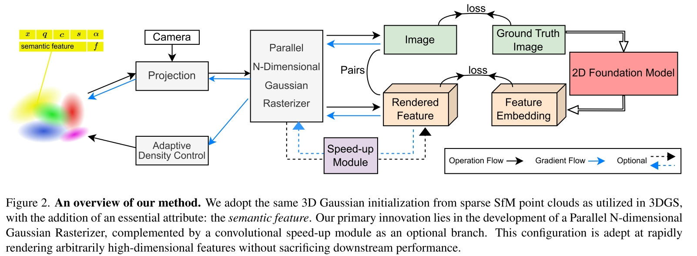

# Feature 3DGS: Supercharging 3D Gaussian Splatting to Enable Distilled Feature Fields
Shijie Zhou, Haoran Chang, Sicheng Jiang, Achuta Kadambi

将 3D Gaussian Spaltting 扩展到 semantic space，利用现有 VLM，做到对3D场景的semantic表示，可以做到任意视角 segmentation，甚至 language-guide (3D) editing 等 VLM 对图片的操作。

核心是一个知识蒸馏(distillation)方案，能够直接将 2D Foundation Model 应用到 Gaussian Spalltting 中。本文并不是首先做这件事的，之前已经有在 NeRF 上做类似任务的工作。而本文将 NeRF Pipeline 换成 Gaussian Splatting 之后，速度和效果都有了显著提升。

## About Gaussian Splatting
- [blog](https://huggingface.co/blog/gaussian-splatting)

Gaussian Splatting 也是一种 explicit 的 3D 建模方式，类比 Mesh Model，Gaussian Splatting 相当于把 Triangle Mesh 换成了 Gaussian Distribution

每个 Gaussian 都由以下参数描述
- Position
- Covariance (3x3)，描述了拉伸和缩放
- Color，一个颜色
- Alpha

想要完美的建模一个 3D 场景，需要的 Gaussians 数量可以达到百万级。

Gaussian Splatting Rasterization Pipeline
- Structure from Motion (SfM)，从图片中提取一堆 Point Cloud
- Point Cloud 中的每个点都可以代表一个 Gaussian，其中 Position 和 Color 信息可以直接从 Point Cloud 中获取，其他参数则需要通过训练得到
- 训练
  - Differentiable gaussian rasterization，将 Gaussians 渲染到图片
  - 根据渲染出的图片和真实图片之间的差距作为 loss
  - 使用随机梯度下降训练 Covariance, Alpha 等参数，在此过程中对梯度进行一定限制，对 Gaussians 本身进行一定剪枝（去掉 alpha 小的）

上述过程中的核心是 Differentiable gaussian rasterization，它承担了 NeRF 中 volume rendering 的工作，速度上更快。它最简单的实现可以理解为以下过程
- 把 Gaussians 投影到相机平面
- 按照 depth 排序
- 对每个像素，从近到远渲染最终颜色。

该过程中不管是投影过程还是混色过程都是 differential 的，从而能够用于训练。

## Core Idea
本文的核心思路就是在原本 Gaussian Splatting 的 Parameters 的基础上，为每个 Gaussian 增加一个 learnable semantic feature。在原本的 Differentiable gaussian rasterization 过程中，把这些 semantic feature 也泼溅回 2D，用 2D Foundation Model 来引导训练。

这个过程可以很简单，比如就把 semantic feature 按照颜色一样处理，然后和 VLM 得到的 feature 之间算 loss。但是这种简单的思路效率不够，SAM 得到的 feature 有 256 维，如果给每个 Gaussian 学一个 256 维的 feature 将会很低效。本文采取的方法是在 3D feature 和 2D feature 之间又加了一个小的 decoder，从低纬度的 3D feature field 重新上采样到 2D feature。

## Method

