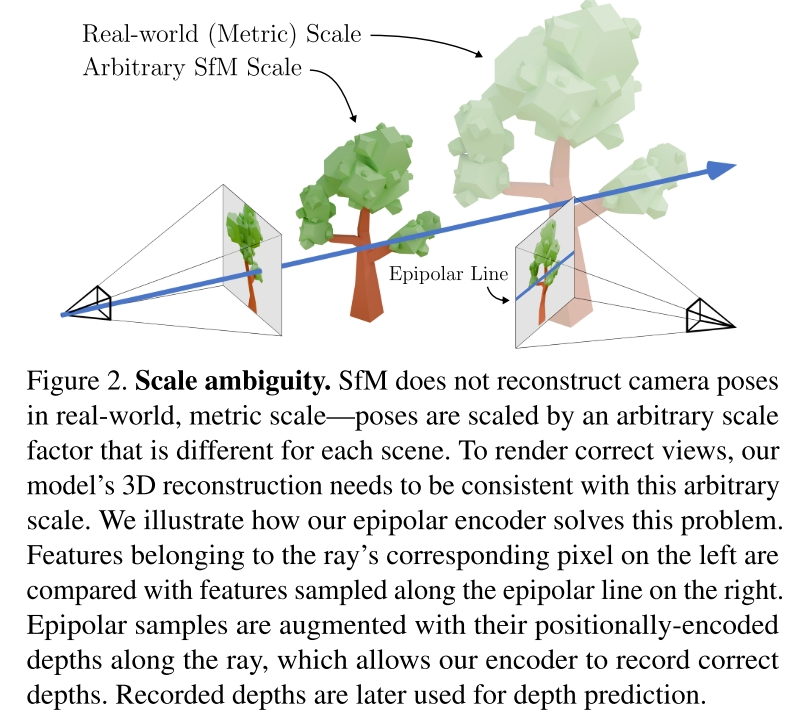

# pixelSplat: 3D Gaussian Splats from Image Pairs for Scalable Generalizable 3D Reconstruction
David Charatan, Sizhe Lester Li, Massachusetts Institute of Technology, Andrea Tagliasacchi, Vincent Sitzmann, Simon Fraser University, University of Toronto

[page](https://davidcharatan.com/pixelsplat/)

CORE IDEA: **Integrage 3D Gaussians in an end-to-end differentiable system**

Task: generalizable novel view synthesis from sparse image observations. 输入两张图片，以及两张图片对应的 camera pose，和 target view 的 camera pose，输出 Target View 的渲染结果。

本文最核心的点在于不需要对大量的 gaussian primitives 进行回归训练，而是只需要对多帧图片进行一次 forward pass 就可以得到 gaussians 的 prediction。

在本文的基础上进一步改进的工作 [MVSplat](https://github.com/donydchen/mvsplat) 能够更快速、更少的参数得到更好的结果，之后看一下。

## Method
方法的核心是利用对极几何 (Epipolar Geometry) 计算多帧之间 ray 的关联性。上次看到这个词还是在 [Is Attention All That NeRF Needs](./[2023%20ICLR]%20Is%20Attention%20All%20That%20NeRF%20Needs.md)。然后从多帧（两帧）中估计 Gaussian Primitive 的分布，从该分布中采样实际用于渲染的 Gaussians。

### Problem of Gaussian Splatting

Gaussian Splatting 容易陷入 local minima。Gaussian Splatting 的通常流程是，将场景建模成一堆 Gaussians $\{g_k = (\mu_k,\Sigma_k,\alpha_k,S_k)\}_k^K$ ，这里四个参数分别是位置、形状（covarianve）、透明度、颜色（spherical harmonics coefficient）。然后通过梯度下降来修正这些 gaussians 的参数，从而使其最大化已知 image sample 的 likelihood，这和更早的 Gaussian Mixture Model 是一个思路。这种建模方式和 NeRF 对比有个显著的弊端，就是其稀疏性和非连续性（当然也有优势，训练快，inference 快得多）。整个场景的大部分区域实际上都是空的，对于 GS 来说，这些区域就没有 gaussians， $\mu_k$ 相应的也是不连续的。如果随机初始化，就会很容易陷入 local minima，gaussians 的位置并不能连续的依靠梯度下降移动到正确的位置。之前的 GS 方法的解决方案有两个，首先不随机初始化 $\mu$，而是用一些 matching 算法得到一些 sample coordinates。另外，在回归过程中，借助 non-differentiable pruning and splitting operations 调整 gaussians 的数量和位置等。
本文希望 gaussians parameters 是直接由模型估计出来的。

### Scale Ambiguity Problem

对于 novel-view-synthesis problem 来说，其输入通常是一堆 Image 和其 camera pose。问题在于通常来说 camera pose 是由 structure-from-motion (SfM) 的方法算出来的。而这个 pose 的尺度和 depth estimation 的尺度是不统一的，他们各自有自己的 scale。

如上图所示，如果 SfM 的 camera pose 和 depth estimation 的 scale 一致，那么图片 $I$ 里的一个像素以及其 depth，可以唯一的映射到图片 $\tilde{I}$ 中的对应像素。但由于上面提到的 Scale Ambiguity，实际上可能映射到 Epipolar Line 上的所有像素。

为此本文使用 Epipolar Attention 来计算两帧之间像素的关联性，做法和 [Is Attention All that NeRF Needs](./[2023%20ICLR]%20Is%20Attention%20All%20That%20NeRF%20Needs.md) 里面差不多。

具体做法如下 Epipolar Attention 部分所示。

### Epipolar Attention

给出 Image Pair $I,\tilde{I}$，从 $I$ 中选取 pixel $u$，该像素对应的射线在 $\tilde{I}$ 上的投影为 epipolar line $l$。

从 $l$ 上采样一系列 pixels $\{\tilde{u}\}\sim \tilde{I}$。对这些像素，计算他们和 $I$ 的 camera origin 的距离 $\tilde{d}_{\tilde{u}}$，根据这些信息来计算 QKV

$$
\begin{align*}
s&=\tilde{F}[\tilde{u}_l] \oplus \gamma(\tilde{d}_{\tilde{u}}) \\
q&=Q\cdot F[u],~~ k_l=K\cdot s, ~~v_l=V\cdot s
\end{align*}
$$

$F$ 是对输入的 image encode 得到的 feature，$\gamma$ 是相对另一帧的相机 origin 距离的 positional encoding，将这两部分拼起来得到像素的 feature $s$。用 epipolar line feature $s$ 得到 KV，与另一帧中的单像素的 q 计算 epipolar cross attention。epipolar cross attention 的结果是一个包含了 epipolar line 上的 pixel 的 feature 信息的，conditioned on pixel $u$ 的 softmax attention $\text{Att}(q,\{k_l\}, \{v_l\})$。

该 feature vector 用于更新像素 $u$ 的 feature

$$F[u] += \text{Att}(q,\{k_l\}, \{v_l\})$$

这个做法和 [Is Attention All That NeRF Needs](./[2023%20ICLR]%20Is%20Attention%20All%20That%20NeRF%20Needs.md) 中几乎一样，这里的 $\tilde{I}$ 对应了那里的 target view。

得到 cross attention 之后，还会在 $I$ 的 pixels 之间算 self attention。

$$F+=\text{SelfAttention}(F)$$

**本文也讨论了将上述方法扩展到不只两帧的情形。**

## Gaussian Parameter Prediction

从上面得到的 Feature Map $F$ 中估计 Gaussian Primitives $\{g_k=(\mu_k, \Sigma_k,\alpha_k,S_k)\}_k^K$

本文的基本逻辑是对每个像素 $u$，输入前面得到的 $F[u]$，输出一个 Gaussian Primitive $(\mu,\Sigma,\alpha,S)$

由于前面提到的 GS 的稀疏性和非连续性，直接回归参数，尤其是位置 $\mu$ 的效果不好，容易陷入 local minima。本文的做法是 predict probability density of $\mu$。

## Question & Ideas

- 在 wrist-mounted RGBD camera 以及 arm robot 这个设定下，camera pose 以及 depth 都可以是已知的。这时候文中的 Epipolar Attention 部分是不是可以简化？（本文的 pose 也是已知的）
- 如何利用 Depth Sensor ? 
  - 能否 predict 偏差值？会有比较大的 sim-real gap，而且 real 场景中的 depth sensor 有很多信息缺失
  - 先补全，后直接用作 $\mu$，不合理的丢弃？补全关键词：Depth Completion
- 如何多帧融合？
  - 直接进行剪枝？
  - 进行一次 forward 一次 backward。forward 根据新来的帧更新场景中的 gaussians，并进行必要的剪枝。backward 则直接用 differential volume rendering 修正参数。backward 过程可以对历史上的多帧进行。