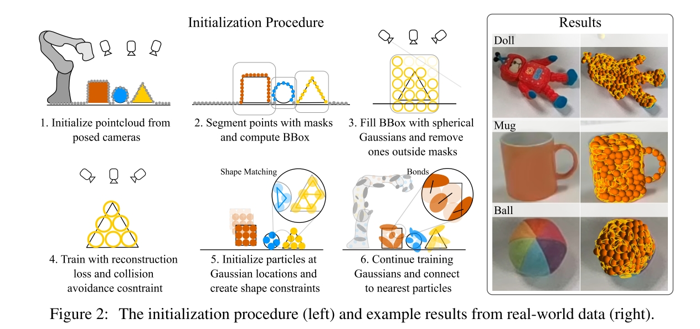
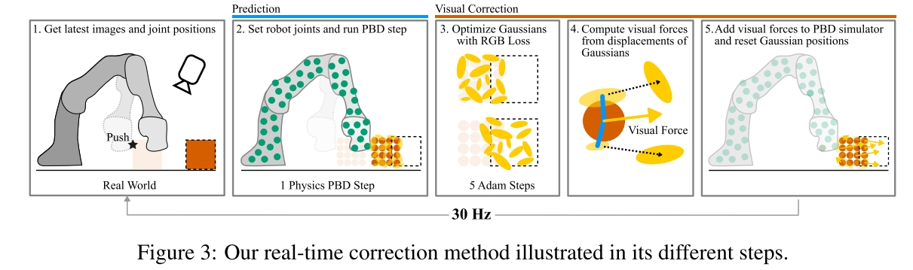

# Physically EmbodiedGaussian Splatting: ARealtime Correctable WorldModel for Robotics

[website](https://embodied-gaussians.github.io/)

Task: 用 Gaussian Splatting 来建模物理。最终做到在30HZ下用视觉实时修正模拟得到准确的模拟结果。

实际的物理模拟采用的是 Particle-Based Physics Simulation，但是由于引入了 Gaussian Splatting，可以支持 online 地根据当前观测和渲染之间的差别修正 Gaussians 的参数，进一步修正物理过程。

视觉观测来自三个固定相机。

## Method

核心：在原本的 Particle-Based Physics (PBD) 的 constraints 基础上引入 Gaussian-Particle Bonds，最直观的做法就是直接在 Particle 上绑 Gaussian

### Initialization

- 输入三个相机的 RGBD 图片
- **手动**用工具标 instance mask，并提取 bounding box
- 在 bounding box 里面均匀的填充半径 4-7 mm 的 Gaussian Primitives，没办法落到 instance mask 内的被剪枝掉。
- 对 Gaussians 进行回归，需要注意的是这时候 Gaussians 也会按照 Particle 需要遵守的 PBD Constraints，具体来说是保证不穿地面的 ground constraint 和 保证 particle 之间 不完全重合的 collision constraint，来进行回归。也就是除了正常 Gaussian Splatting 的随机梯度下降的回归过程之外，其位置也要由 PBD Solver 来优化。此时不会优化 Gaussian 的 scale 参数（$\Sigma$），这是为了限制 Gaussian 的影响范围，保证后续在 Gaussian 位置上初始化的 Particle 保持合理的密度。
- 第二次剪枝，透明度低于 0.3 的被剪枝掉。
- 在剩下的 Gaussians 的位置上初始化 Particles，这时候再把属于同一个物体的 Particles (连带着 Gaussians) 关联起来，后续解 PBD 的时候也会对 shape matching constraint 进行优化。对于刚体和柔性体这部分的 shape constraint 有区别，刚体还是柔性体是人为指定的。
- 进一步优化 Gaussians，此时会优化包括 $\Sigma$ 的所有参数，同时添加必要的 Gaussians。优化完后，每个 Gaussian 会和离他最近的 Particle Bond 起来，Gaussian 和 Particle 的相对位置（pose）会被记录下来作为 Bond。

经过初始化过程，得到了用于物理模拟的 particles 和用于渲染的 Gaussians，并且每个**属于物体**的 Gaussian 都和这个物体的某个 Particle bond 起来。

### Online Prediction and Correction

在 PBD 的过程中用 Gaussian Splatting 来修正模拟，核心在于从 Gaussian 中计算 Visual Force 作用在和 Gaussians 关联的 Particles 上。

- 首先运行 PBD 模拟一个 step，把和 Particles 关联的 Gaussians 也移动过去
- 将新的 Gaussians 渲染到三个视角
- 算渲染和真值之间的 difference，然后更新 Gaussians 的参数。
- 将更新后的 Gaussian 和随着

## Question
- Gaussians 的初始化过程中是如何针对 PBD 中的 Constraint 进行优化的？
- 在修正过程中如何保证 Gaussian 和 Particle 之间 Bond 的一致性？比如看到了之前看不到的部分。这时候怎么由先前的 Gaussian 指导 PBD？
- 文章的方法能否脱离修正过程？即对模型用 Image 进行一定修正之后，后续就不修正了，还能不能保证 PBD 和 Image 的准确性？

----

- How can ground constraints and collision constraints be applied during the initialization of Gaussian primitives?
- How can consistency between Gaussians and particles be maintained during simulation? For example, when some invisble part of object is captured by camera during manipulation. Is inconsistency a significant issue?
Can the simulation process be decoupled from the correction phase?
- As a potential direction for future work, is it possible to optimize physics simulation parameters during some initial steps of gaussian correction?