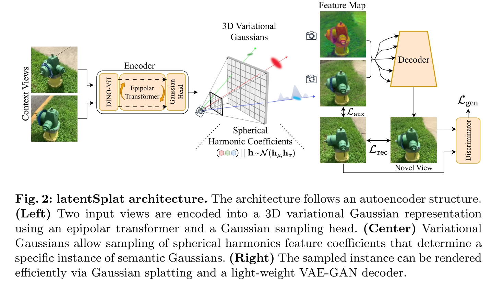

# latentSplat: Autoencoding Variational Gaussians for Fast Generalizable 3D Reconstruction
Christopher Wewer, Kevin Raj, Eddy Ilg, Bernt Schiele, and Jan Eric Lenssen

**(这篇写得太含糊其辞了，感觉还是顺着 [pixelSplat](./[2024%20CVPR]%20pixelSplat%203D%20Gaussian%20Splats%20from%20Image%20Pairs%20for%20Scalable%20Generalizable%203D%20Reconstruction.md) 读靠谱点)**

[webpage](https://geometric-rl.mpi-inf.mpg.de/latentsplat/), [github](https://github.com/Chrixtar/latentsplat?tab=readme-ov-file)

一个用 VAE 做快速 3D Gaussian Splatting 的方法，核心在于没有使用 NeRF 或者 3DGS 的训练方式，而是使用 Generative Model 来实现 3DGS。

Task: Novel View Synthesis（NVS）。"find an optimal 3D representation that fits a set of observations". 

输入两帧图片，生成从任意视角观察该场景的图片。既可以是围绕单个物体的360°图片，也可以是对场景的某个视角的图片。输入图片的 camera pose 是已知的。

## Related Work
本文将现有的 Novel View Synthesis 方案分成了两大类：Regression-based approaches 和 Generative approaches。

Regression-based approaches 最直接的例子就是之前的 3D Gaussian Splatting，通过回归 Parameters of gaussian 来 fit a set of observations。本文和这些方案的区别体现在两个方面
- 回归的参数不同，不在使用 explicit gaussian，而是使用一个 semantic feature representation
- 对 uncertainty 进行建模，从而能够对 out-of-context views 也有一定生成能力。

Generative Approaches 则常见于 3D reconstructions 任务，从非常有限的 observation 中重建（生成）完整的3D信息。还有一类是 diffusion model，已经有一些方法将 diffusion model 直接用在了 3D reconstruction 任务中。

## Autoencoding Variational Gaussians

本文中的一个3D场景通过以下 variational gaussians 来表示

$$\mathcal{G} = \{(x,S,R,o,c,h_\mu,h_\sigma)_i\}_{1\leq i \leq N}$$

## Question
- 本文以及相关工作经常提到 Novel View，那这些方法能不能直接建模 Novelty？比如能够衡量某个 view 是否在已有的观测范围内？
- <del>了解一下 Epipolar cross attention，看起来是个算多视角之间 cross attention 的好方法。</del> 就是[Is Attention All that NeRF Needs](./[2023%20ICLR]%20Is%20Attention%20All%20That%20NeRF%20Needs.md) 里面的那个。