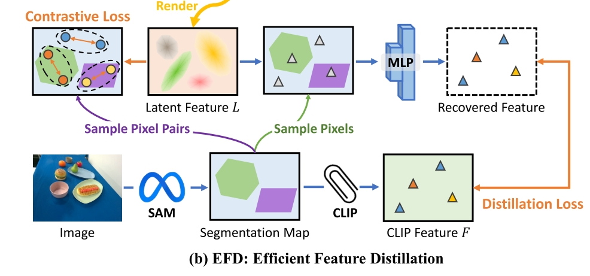

# GaussianGrasper: 3D Language Gaussian Splatting for Open-vocabulary Robotic Grasping
Yuhang Zheng, Xiangyu Chen, Yupeng Zheng, Songen Gu, Runyi Yang, Bu Jin, Pengfei Li, Chengliang Zhong, Zengmao Wang, Lina Liu, Chao Yang, Dawei Wang, Zhen Chen, Xiaoxiao Long∗, Meiqing Wang∗

（文章的 related work 里面列了很多值得一看的文章，尤其是 distilled feature fields）

- [github](https://github.com/MrSecant/GaussianGrasper)
- [page](https://mrsecant.github.io/GaussianGrasper/)

类似 [Feature 3DGS](./[2024%20CVPR]%20Feature%203DGS%20Supercharging%203D%20Gaussian%20Splatting%20to%20Enable%20Distilled%20Feature%20Fields.md)，但是解决更具体的 Open-vocabulary robotic grasping 问题。

和 Feature 3DGS 不同的点在于，总体上本文是一个先重建 Gaussian Splatting Field，然后做 Feature Distillation 的方案。本文希望解决的痛点包括
- 直接使用 2D Foundation Model 所带来的视角间不一致问题
- 提升其他 semantic field 方案的效果，例如 [LERF](https://github.com/kerrj/lerf)，在效果和 query 速度上都有显著提高。

## Method
总体流程
- 采集 multi-view RGB-D image，初始化 Gaussian Field
- 应用 Efficient Feature Distillation Module 来重建完整的 3D **Feature Field**
- language-guided manipulation

### Efficient Feature Distillation
目标是把 semantic feature 放到构建好的 field 里面去，要求是
- dense，直接 encode 到 gaussians 中，达到和 rendering 一样的信息密度
- shape-aware，其实是废话，原本的 gaussian field 是 3D 的，把 semantic 直接 encode 进去之后自然也是 3D 的
- open-vocabulary，使用 CLIP feature

#### 生成 Instance-level Segmentation Prior and Open-vocabulary Features：

- 使用 SAM 得到一堆 mask proposals and **corresponding scores**
- 根据 score，对所有 mask 进行一次 non-maximum suppression filter
- 将 Mask Region 经过 CLIP 得到 open vocabulary features.
- 所有 mask 的 CLIP feature 组成一个 feature map $F$

#### Feature distillation
目标是给每个 3D Gaussian primitive 一个 embedded open-vocabulary feature

CLIP feature 是 512-dim 的，而 3DGS 里面会有上万个 gaussians，必须降低 3DGS 中 feature 的维度，即进行 distillation。[feature 3DGS](./[2024%20CVPR]%20Feature%203DGS%20Supercharging%203D%20Gaussian%20Splatting%20to%20Enable%20Distilled%20Feature%20Fields.md) 的做法是用一个小的 CNN Module 来升维，本文思路基本也一样，只是额外加了一个要求同一个 mask 内的 feature 距离接近的 constrastive loss。

上述操作得到的效果是本文的 semantic field 的边界非常清晰，并且有很好的一致性。