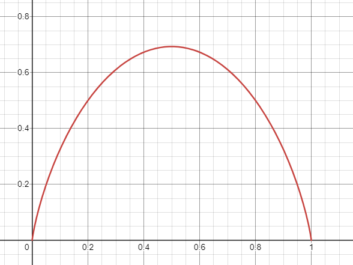
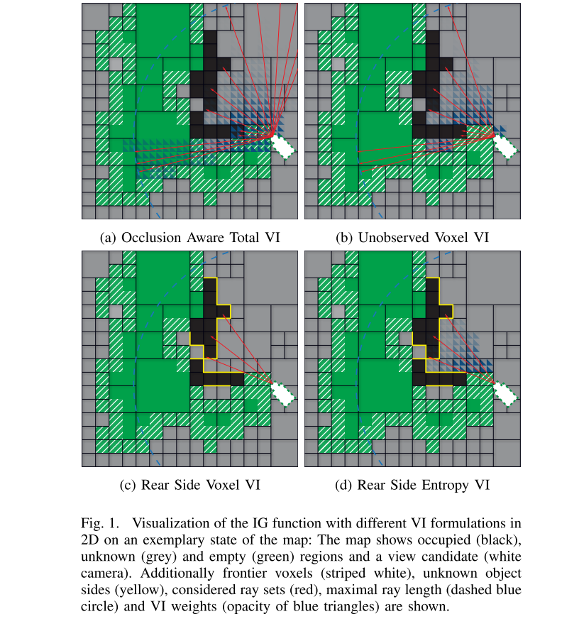

# An Information Gain Formulation for Active Volumetric 3D Reconstruction
Cite 181. [github](https://github.com/uzh-rpg/rpg_ig_active_reconstruction)

Task: the problem of next-best view selection for volumetric reconstruction of an object by a mobile robot equipped with a camera.

本文关注的是传统的 3D 重建任务，直接从 probabilistic volumetric map 中计算 information gain。最终目标是能够观察到物品未观察到的部分。本文偏工程，最核心的目的是为基于 information gain 的NBV编写了统一的软件系统。在后续工作 A comparison of volumetric information gain metrics for active 3D object reconstruction 中使用该软件系统对不同的 information gain 进行了测试和比较。

Problem Setting:
- 物体是未知的，但是在确定的空间范围内。
- 可以获取 dense 的 3D data，但是 sensor 的类型可以是任意的。

在3D重建任务中，选择 view 考虑的两个最重要因素是 information gain 和 possible view point candidates。对于 point candidates 来说，往往需要考虑 robotics kinematics 等因素。而本文**只讨论 information gain**，不关心 robotic system。

NBV方法分类：
- Model Based: 假设指导物体或场景模型，或者至少一定的先验信息。
- Non-Model Based: 物体或场景未知，需要 online 获取。往往依赖于特定的数据结构，用来记录已经获取的信息。
  - surface based，例如基于 mesh model
  - volumetric based，基于 voxel map 或者 octomap，本文便是这一类。这类中往往也要区分 frontier voxel 和 rear side voxel.
  
## Definition
首先明确文中提到的几个词的含义
- Volumatric Information: 由任务定义的一个 information，`We define the Volumetric Information (VI) as a formulation for information enclosed in a voxel`。例如 Rear Side Voxel VI 就是数已经观测到的表面 voxel 的背面还有多少“能看到的”voxel
- Information Gain: 某一个观察角度(candidate)能够为3D重建提供的 Volumetric Information。
- Next Best View: 借助 Information Gain 来计算的观察角度

定义
- $\mathcal{V}$: sensor position 的集合
- $v\in\mathcal{V}$: view position
- $\mathcal{R}_v$: 从单个 view 生成的 rays
- $\mathcal{X}$: 由这些 ray 穿过的 voxels
- $\mathcal{G}_v$: predicted information gain for view v

这样单个 view 能够获得的 cumulative information gain 可以表示成
$$\mathcal{G}_v=\sum_{\forall v\in \mathcal{R}_v}\sum_{\forall x\in\mathcal{X}}\mathcal{I}$$

volumetric information $\mathcal{I}$ 的定义是信息论里面的熵（不确定性）
$$
\mathcal{I}(x)=-P(x)\ln P(x)-\bar{P}(x)\ln\bar{P}(x)
$$
其中 $\bar{P}(x)=1-P(x)$

对于 3D reconstruction 任务，这里的 $P(x)$ 是 occupied probability。对于单个 view v，其观察某个 cell 的时候观察射线会通过一系列cell，此时单个 cell 的 visibility likelihood 为
$$
P_v(x_n)=\prod_{i=1}^{n-1}\bar{P}(x_i)
$$
那么从单个 view v 能够获得到的某个 cell x 的 volumetric information 为
$$
\mathcal{I}_v(x)=P_v(x)\mathcal{I}(x)
$$
需要注意的是
- $P(x)$ 是一个估计值，往往是和距离强相关的一个估计值，这就使得离得越远的 cell，对 IG 的贡献度越小。
- 把这里的定义带入$\mathcal{G}_v=\sum_{\forall v\in \mathcal{R}_v}\sum_{\forall x\in\mathcal{X}}\mathcal{I}$，就可以算出来每个 view 的 IG，这可以被看作是对当前 visable volumn 的一个 entropy estimation
- 使用 volumetric information 算出来的 NBV 可以认为是具有最高 visable uncertainty 的 view。

文中测试的4中 volumetric information 及其相应的 ray information gain 如下图所示(以2D环境方便可视化)

上图中黑色为已知 occupied cell，绿色的为已知 empty cell，灰色为未知，白色条纹表示 frontier，蓝色虚线划定了 sensor range，蓝色三角的颜色深度则是对应 VI 的权重值。黄色线代表的是物体的 rear side，换句话说就是 occupied cell 和 unknown cell 之间的边界。图中展示的是一个新的 view，所以视线范围内有大量灰色的未知 cell。
- Occusion Aware Total VI：$\mathcal{I}_v(x)=P_v(x)\mathcal{I}(x)$，即用可见性*entropy 作为 visable uncertainty 的衡量
- Unobserved Voxel VI：和上面一样，只不过只考虑未知的 cell
- Rear Side Voxel VI：数一数物体的 rear side（黄色线）有多少能被看到。
- Rear Side Entropy VI：和第一条一样，只是只考虑可以看到 rear side 的 ray。

**注意：** 本文并不依赖于 Neural Network。理论上当然可以用一个 Neural Network 来 predict volumetric information，但在最简单的情况下，直接使用 OctoMap Updating，未知的区域 prob 为 0.5，然后随着 sample 数量的增加逐渐更新。

## Software Architecture Design
本文将一个可以进行 active 3D reconstruction 的软件架构划分成以下几个部分
- Sensor
- Reconstruction Module，用于重建的视觉算法，例如 stereo-matching，或者 monocular depth estimation
- Model Representation，模型信息的数据结构，也决定了如何计算 IG
- View Planner，进行实际的 NBV decision
- Robot Interface Layer，对机器人的抽象，另外能够提供机器人的 view cost 之类的信息。
- Robot Driver，对 Robot Interface 的实现，由实际的硬件决定。

本文的 
