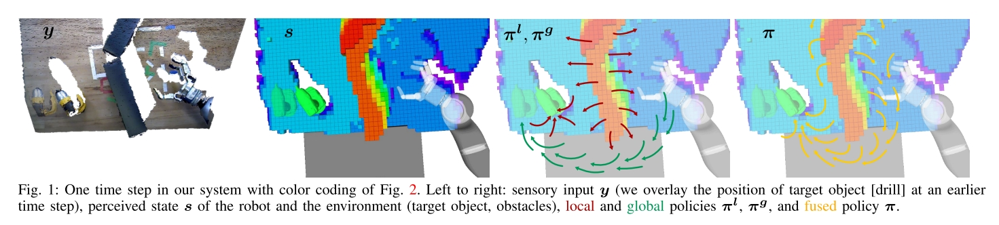

# Real-time perception meets reactive motion generation
Cite 95

解决的问题是在 uncertain 的环境中做 grasp 和 manipulation。整个 perception, planning 和 execution 是以 reactive 的方式进行的。

本文最终目标是搭建 reactive motion generation 的软件系统，并且在该系统上测试了许多不同方法。

是否有 perception planning???

## Sense-Plan-Act
