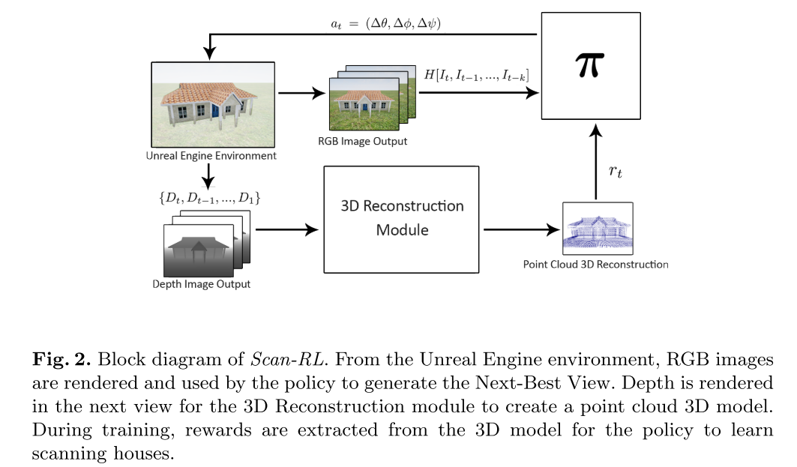

# Next-Best View Policy for 3D Reconstruction
Cite 43

- [ScanRL github](https://github.com/darylperalta/ScanRL)

Task: 
View Planning Problem, Next-Best View(NBV): selecting the Next-Best View (NBV) which is the next sensor position that maximizes the information gain.

Env:
Scan houses with fewer number of steps and a shorter distance. 即通过预测下一个最佳观察角度的方式最高效完成3D重建任务。重建的目标是单个建筑物（不是室内场景，而是建筑本身）

agent 只输入当前单帧图片（而不输入重建进度信息），方案框架是一个 RL 算法。

## Related Work
本文 related work 部分对 NBV 算法做了一些有趣的探讨。
NBV 算法总体上分为两大类
- 计算如何用更少的 view 去覆盖 object
- 用衡量 information gain 的方式来设计 NBV planner。

本文的算法参考了第二类，只不过比起 information gain，本文用更直接的 "improvement in the 3D reconstruction" 来训练 policy。

参考文献里似乎值得一读的
- [x] [An Information Gain Formulation for Active Volumetric 3D Reconstruction](./[2016%20ICRA]%20An%20Information%20Gain%20Formulation%20for%20Active%20Volumetric%203D%20Reconstruction.md)，似乎设计了衡量 information 的 metric
- ref 24，用TSDF来辅助 NBV
- ref 6, 用voxel来作为数据结构
- ref 28, 直接从 point cloud 里面算
- ref 30, deep RL，但是只针对单物体且依赖模型
- ref 8, deep RL, 为了补全环境中的 depth 等信息，核心不在 path planning

## Method

总体是一个 RL 的框架
- 输入图片序列
- 用重建结果对模型的“覆盖率”作为reward
- 输出camera pose