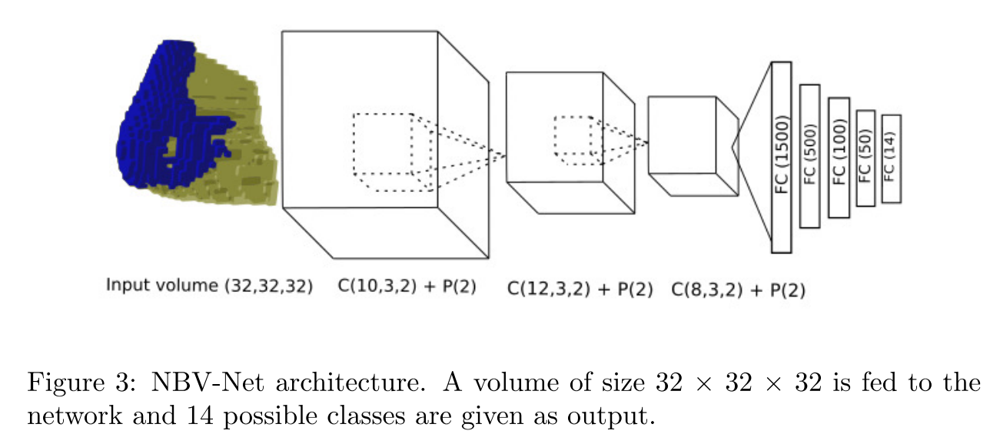

# Supervised Learning of the Next-Best-View for 3D Object Reconstruction
Cite 73.

用 3D CNN 直接 predict sensor pose。
输入的数据结构是 uniform probabilistic occupancy grid，sensor pose 则是以离散化的有限的候选，model 直接以分类任务的形式 predict pose。

