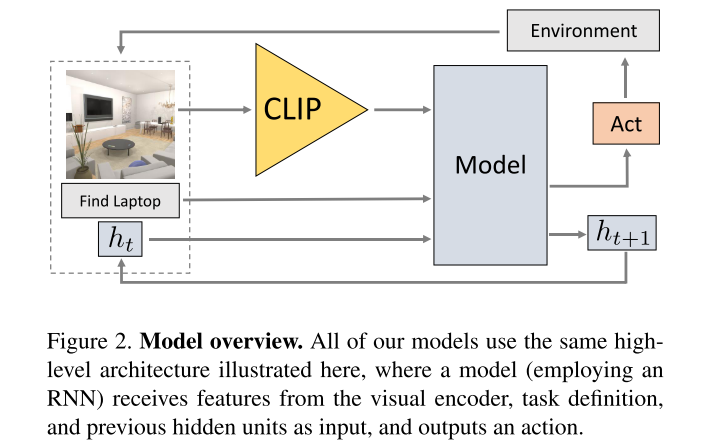

# Simple but effective: Clip embeddings for embodied ai
Cite 171. EmbCLIP paper. [Code](https://github.com/allenai/embodied-clip)
作为 CLIP Model 在 Object Navigation 任务中的一个直接应用，几乎没有多少算法设计，本身定位是一个 baseline algorithm. 但是本文的效果已经比以往的 ObjNav 的方法要好了。

Task: zero-shot Object Goal Navigation.

这里的 zero-shot 指的是可以直接用 language 的形式给出目标，并且这个目标以及对应的文本不会在训练数据中出现。

## Method

是一个 Actor Critic RL Architecture，同时为了做长期规划，使用了 hidden state。

- 使用 CLIP ResNet-50 visual encoder. 不做 fine-tuning. 该部分输入是 3x244x244 RGB，输出是 2048x7x7，是 CLIP 在最终 pooling & classification 之前的输出。
- goal 在不同的 benchmark 中可能有不同的格式
  - ObjectNav in RoboTHOR: goal 是单个 category index $g\in \{0,...,11\}$。文中描述是 `g is used to index a (trainable) embedding matrix and form a 32-dim goal embedding G`，不太明白这里的 index 是啥意思，但总之得到 32-dim embedding。然后CLIP得到的 feature 进一步通过 CNN 降维到 32-dim，和 goal embedding 拼起来得到 64x7x7
- 将 CLIP + goal 拼出来的 embedding，输入一个 RNN Model，最终经过 flatten 之后得到一个 1568-dim goal-conditioned visual embedding。这部分 Model 与[Habitat](https://aihabitat.org/challenge/2023/)、[RoboTHOR](https://ai2thor.allenai.org/robothor/)等benchmark提供的 baseline model 类似。
- 将 1568-dim embedding 和 512-dim hidden units，输入 GRU，输出更新后的 hidden-state 和一个 6-dim logits。
- 最后又两个 output head，一个输出 actor 一个输出 critic

本文强调使用几乎相同的model（指后面RNN部分是原有baseline做修改），只是将 feature 换成 CLIP embedding，就可以大幅提升表现。

不过从绝对值上看，本文的方法成功率依然非常低。

