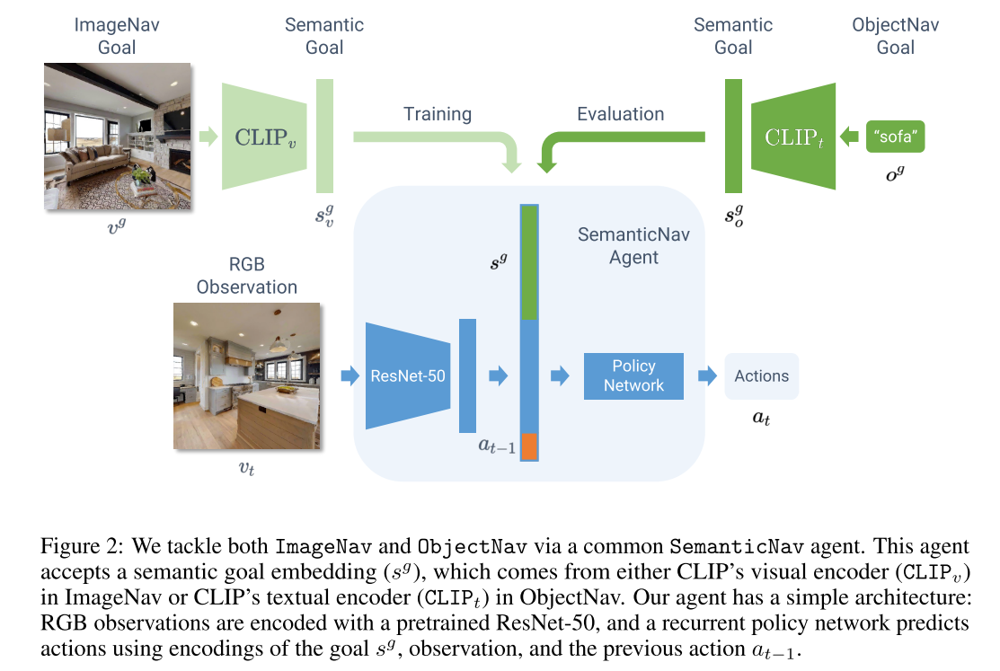

# ZSON: Zero-Shot Object-Goal Navigation using Multimodal Goal Embeddings
Cite 58. [github zson](https://github.com/gunagg/zson)

Task: Open-world object-goal navigation。用自然语言说出一个物品，agent去寻找（能近距离拍到），参考 [Habitat Challenge 2022](https://aihabitat.org/challenge/2022/)。除此之外本文强调 Zero-shot: 不需要 reward 或者 demonstration，open-world: 不局限于特定类别物品。

## Method

总体依旧是 RL 框架，核心是上图的 SemanticNav Agent。输入 Semantic Embedding，Observation Encoding，action history，输出 action。训练时定义是否在规定距离和角度范围内找到物体为 reward，加上和物体相对距离改变作为 heiristic reward。