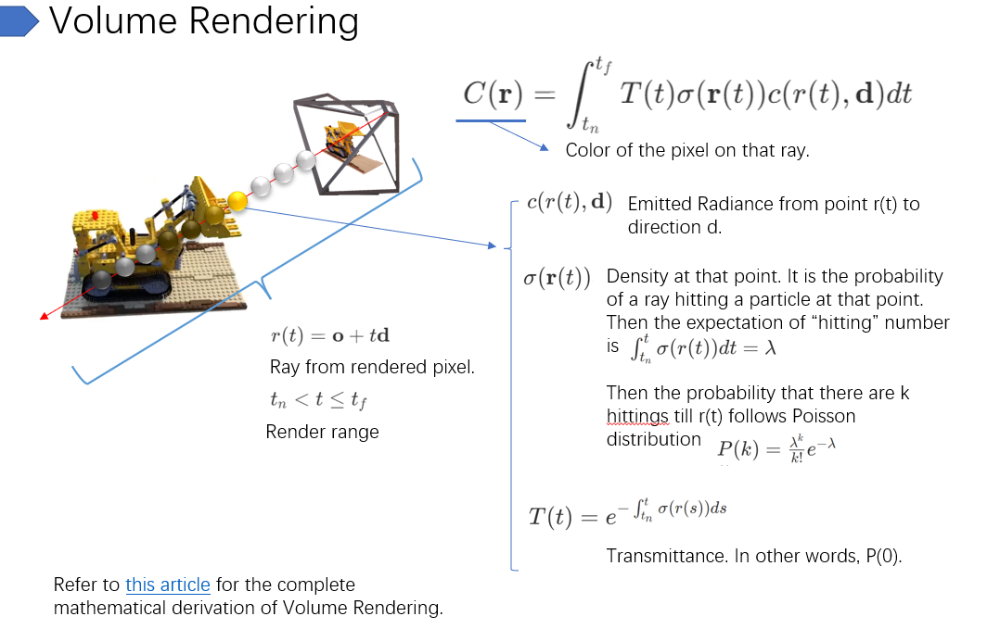
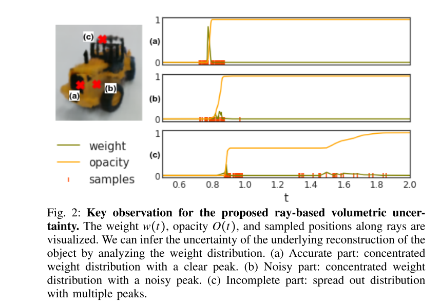
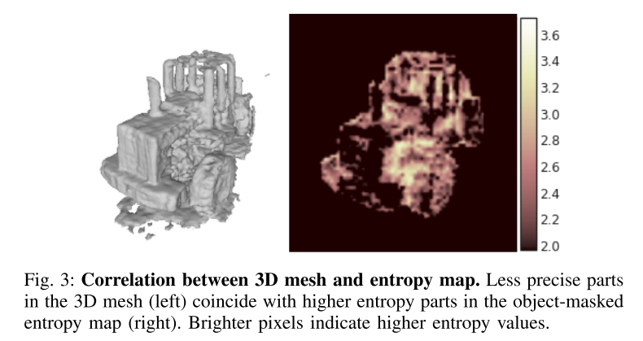

# Uncertainty Guided Policy for Active Robotic 3D Reconstruction using Neural Radiance Fields
Cite 40
用 NeRF 来引导3D重建的最佳视角。并不是直接从 NeRF 里生成 reconstruction，而是用 NeRF 辅助 NBV Planning，然后完成 reconstruction。

但是这个“重建”指的是从 NeRF 中 recover surface，与其说引导 3D 重建，不如说引导 NeRF Building.

思想上和 [S-NeRF](../NeRF/[2021%203DV]%20Stochastic%20Neural%20Radiance%20Fields%20Quantifying%20Uncertainty%20in%20Implicit%203D%20Representations.md) 高度相似，本文也列在 reference 里面了。给人的感觉几乎是，没做什么新东西，只是用了一下 S-NeRF 的思路。

## Math & Method
NeRF 所使用的 Volume Rendering 如下

$T$ 可以看作是透明度，定义上是光线出发到距离 $t$ 位置没有发生任何碰撞，或者说光线到达距离 $t$ 的概率。对应的不透明度 $O(t)=1-T(t)$

本文所采用的方法关心的是不透明度的导数，即其概率密度函数，文中称之为 weight
$$
w(t)=\frac{dO}{dt}(t)=T(t)\sigma(r(t))
$$

当观察一个不透明物体时，$w(t)$ 的值应该是在物体表面很高，在其他位置，不管是靠近观察点还是远离观察点，都接近0。换句话说 $w(t)$ 就是 NeRF 对于物体表面的一个 estimation。

观察不透明物体时，如果 NeRF 已经很完美的收敛了，那么 $w(t)$ 的值应该很集中与一个位置。而反过来，**如果 $w(t)$ 的值还很分散，则说明 NeRF 并没有完全收敛，说明这个区域的 3D 信息是需要进一步获取的。** 这是本文的基本思路。

本文将 $w(t)$ 的离散程度称为 ray-based volumetric uncertainty，这也是题目由来。

NeRF 在不同收敛程度下的 volumetric uncertainty 如下

这种 uncertainty 的定义和熵 entropy 是一致的，$w(t)$ 看作是一个概率分布，分布越集中，其熵越小，对应 uncertainty 越小。当概率完全集中于一点的时候，熵为0。由于在定义上 $w(t)$ 是不透明度的概率密度函数，所以计算其熵也是完全数学上说得通的。

除了本文似乎还有其他工作有类似思路，例如对于透明物体，也会有很高的 w entropy，所以该方法也可以用于 detect 透明物体。

一个对 NeRF 不同区域 entropy 的可视化

本文的算法其实就是，对于给定的 views，计算每个 view 的平均 entropy，然后取 entropy 最大的作为 next view。

## 问题
- `entropy 高 -> 3D信息不完整`，这个逻辑是没有问题的。但是 `entropy 低 -> 3D信息完整，3D信息不完整 -> entropy高`，这个假设是没有依据的。本文选择性的忽视这一点，其实说不太通。entropy 低只代表模型对于当前 query 会给出一个很确定的结果，却不能保证结果的正确性。