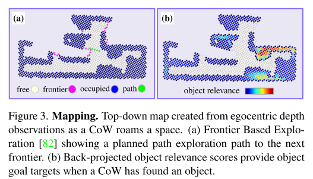
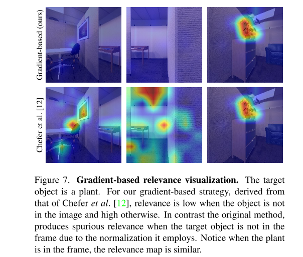

# CoWs on pasture: Baselines and benchmarks for language-driven zero-shot object navigation
Shuran Song. CLIP on Wheels
- [page](https://cow.cs.columbia.edu/)

**文章写得屎一样**

Task: Language-driven zero-shot object navigation (L-ZSON)
> finding uncommon objects, objects described by spatial and appearance attributes, and hidden objects described relative to visible objects.

直接使用 VLM model 来寻找一个用语言描述的物品。**本文是一个 benchmark**。
- Task 强调 zero shot
- 所谓的 Language driven 强调不是一个类别，而是一句描述

## Method （BaseLine）
总体逻辑是，将场景信息维护在一个不断更新的 top down view depth map 里面。随着 agent 探索环境，通过 CLIP 来不断更新 cofidence about the target object's location。当 confidence 高于特定值的时候认为找到了物品。

为了完成上述流程，需要以下模块：
- 将多视角 RGBD Observation 映射到 top down view depth map 的算法和数据结构。
- 决策接下来观察的 view。
- 在能观察到物体的时候能够完成识别和定位

### Depth-based Mapping
是一个不断更新的 top-down view depth map，构建过程使用了机器人自带的深度相机、机器人位姿信息。map的分辨率为 $0.125m$，是一个很粗糙的 map。为了将 depth image 变成一个 2D map，本文将采用的方法是根据机器人的身高，将地面的 points 视为 free，将会挡到机器人的视为 occupied，然后离散化成 0.125m 分辨率。

该 map 一方面包含了障碍物信息以用于 navigation，另一方面也存储了一部分 semantic 信息以用于寻找物体。

图中的 path 是下面的 Exploration Alg 输出的，object relevance 则是 object localization 的结果 project 到 top-down view 的结果。

### Exploration Algorithm
Exploration Algorithm 可以理解为本文的 path planner，用于指导机器人下一步如何运动，如何探索周围环境以寻找 target object。

**Frontier Based Exploration** 是本文采用的基本路径规划算法.
> Using the top-down map discussed in Sec. 4.1,, a CoW can navigate using a simple exploration heuristic: move to the frontier between free and unknown space to discover new regions.

本文对啥叫 Frontier 以及如何识别 Frontier 语焉不详，我的理解就是任何在观察高度范围内，会画在 depth map 上的表面。所以 Exploration Alg 在最简单的情况下只需要去那些和 unknown space 相连的障碍即可。

另外本文也不关心 map 的 mismatch 或者更具体的 path 生成算法，当随着 map 的更新出现误差而导致找不到路径的时候，做法是简单的重新创建 map。

**Learnable Exploration** 则是在上面算法的基础上用一个 RL Agent 来进一步引导 agent 探索未知区域。An agent receives a reward of 0.1 for visiting a previously unvisited voxel location (at 0.125m resolution), and a step penalty of -0.01. 
文章对模型输入没有详细介绍，但是提到了模型是 CLIP Backbone + actor critic output head，所以还是图片输入（难道是 top-down 图片？）。输出则是 `{MOVEFORWARD, ROTATERIGHT, ROTATELEFT, STOP}`，移动距离固定为 0.25m，转头角度固定为 30°。

### Object Localization
"The ability to tell if and where an object is in an image", 使用 VLM(CLIP) 来定位物体，是本文可以处理 L-ZSON 问题的能力所在。任务和 object detection 是基本上一致的，但是文本描述并不限制在特定的类型范围内。

输入是 Robot 视角的图片和对物体的文本描述，输出一个 relevance map。将该 map project 到 top-down depth map 之后用于 planning。本文使用的 baseline algorithm 包括：
- CLIP with k referring expressions: 用语言来描述图片的不同位置，例如 "a plant in the top left of the image"，然后用 CLIP 生成 k 种描述的 text embedding，并在图片中计算 relevance map，从而确定物体在图片中哪个区域。
- CLIP with k image patches: 上面算法反过来，将图片划分成 k 个 patch 分别计算 relevance score。
- CLIP with gradient relevance. 一些基于 ViT 的通过梯度信息计算 relevance score 的方法，有相关论文。
- MDETR segmentation. 直接使用类似 segment everything 的工具。
- OWL-ViT detection. 和MDETR类似，只不过是直接从 CLIP-like model fine-tuning 来的 object detector

Object Localization 部分的输出大概长下面这样（下图是上面第三种算法的一个可视化）

## Questions & Ideas
- 本文更比起 finding，更像是 grounding，即找到符合描述的物品。方法是完全 model free 的。
- 本文对 Exploration Algorithm 部分，对算法细节的介绍过于模糊了。理论上当视线中找不到物体的时候，这部分算法负责决定找到物体，但是本文的 baseline 算法并没有给出解决这个问题的方案。对于 2D Navigation 来说，观察未知区域的算法可能是非常直观的，或者对应的 heuristic 是非常好设计的。
- 本文对“找到看不到的物体”任务会给特定的 description 来指导去哪里找。
> Hidden object descriptions. An ideal object navigator should find objects, even when they are hidden. To test this capability, we introduce descriptions: “{object} under/in {x}”. For example, “basketball in the dresser drawers” or “vase under the sofa”. We sample large objects (e.g., beds, sofas, dressers) in each scene to determine [under/in] relations. Additionally we remove visible instances of {object} from the room.
> Hidden object descriptions with distractors. We use the hidden object descriptions from before, but reintroduce visible instances of {object} to serve as distractors. Consider finding a “mug under the bed”. A distractor mug will also appear in the scene making the task more challenging.
- 本文的 action space 决定了 planning task 是非常粗粒度的。