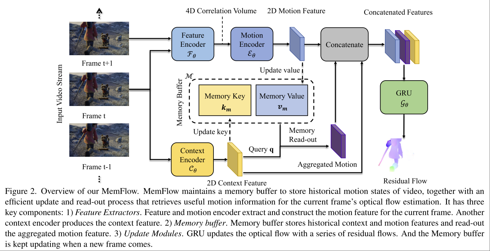
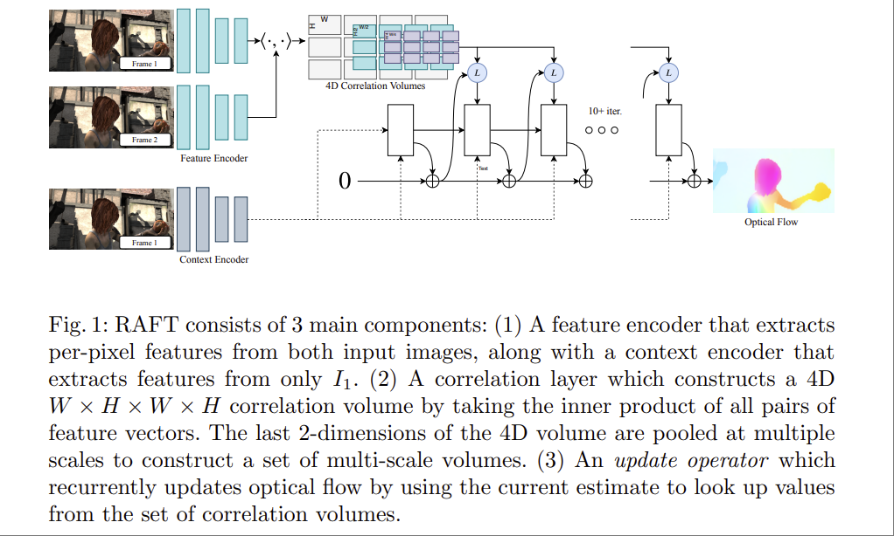
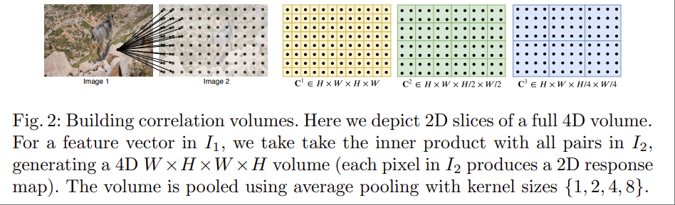

# Memflow: Optical flow estimation and prediction with memory

[website](https://dqiaole.github.io/MemFlow/)

Qiaole Dong and Yanwei Fu
School of Data Science, Fudan University

核心思路是将历史的 optical flow 转变成某种 embedding，能够做到
- 持预测未来1帧的 optical flow。
- operates in real-time, 5.6 frames per second (fps) on A100 GPU for processing 1024x436 videos，简化模型可以进一步加速到 14.5FPS
- 模型非常小，最大的 Transformer 模型权重文件大小只有 50MB，考虑到其精度为32，参数量大概只有 12M。基础模型权重文件只有 24MB，预测未来 flow 的模型则是 20MB。
- 支持变分辨率输入。
- 架构上可以直接对接 ViT Encoder。

架构：

核心是一个 GRU based recurrent architecture，充当最终 output head 的 GRU Module 可以通过不同的迭代次数获取不同精度的结果。如果去掉中间的 Memory Buffer，是一个看上去很简洁的模型

## Encoder

参考了 **2020 ECCV Raft: Recurrent all-pairs field transforms for optical flow**，直接用相关性矩阵来估计 flow。实际上当前大多数 optical flow estimation 都采用了该方法。这部分可以直接参考 RAFT 论文里的图，更详细些

Encoder

$$\mathcal{F}_\theta(I) \in \mathbb{R}^{H\times W\times D}$$

H, W 是图片原本尺寸的 1/8

相邻两帧之间的 特征相关性，直接对 feature 做点积。

$$C = \mathcal{F}_\theta(I_t) \cdot \mathcal{F}_\theta(I_{t+1})^T \in \mathbb{R}^{H\times W\times H\times W}$$

Correlation Volume，对前面得到的 C 的后两个维度做不同尺度的 pooling，下图也是来自 RAFT 论文。

Correlation Loopup

最终的 output head 是一个 GRU，optical flow 被初始化为 0，每个 iteration 都加上估计的残差。对于某个 Iteration 之后的结果 $(f^1, f^2)$，对于每个 $I_t$ 的 pixel $x=(u,v)$，找到当前 flow 估计下的对应像素 $x'=(u+f^1(u), v+ f^2(v))$，计算在一个 local grid 

$$\mathcal{N}(x')_r = \{x+ dx | dx\in \mathbb{Z}^2, \lVert dx \rVert_1\leq r\}$$

内的 correlation volume 中相关值的线性插值，用这个 Lookup 出来的相关值继续迭代 flow estimation，迭代的方式是将相关值和 flow estimation 拼起来作为 GRU 的 input x，在本文中，还会额外过一个 motion encoder $\varepsilon_\theta$ 得到 motion feature

$$
f_m = \varepsilon_\theta(f_i, \text{LookUp}(C, f_i))
$$

## Memory Buffer

额外的 context feature 来得到 $f_c$，用来计算 $q=[f_cW_q], k=[f_cW_k];k_m, v=[f_mWv;v_m]$，这里的 $k_m$ $v_m$来自缓存。使用 cross attention 从 buffer 中得到 feature，融合到当前的 $f_m$ 中得到 aggregated motion feature $f_{am}$，随后缓存 kv。

## Future Prediction

目前是个没啥用的玩具。

直接从 buffer 中获取 $f_m$，用一个卷积网络直接预测 flow，但是 buffer 的更新依然依赖于下一帧到来的时候。
