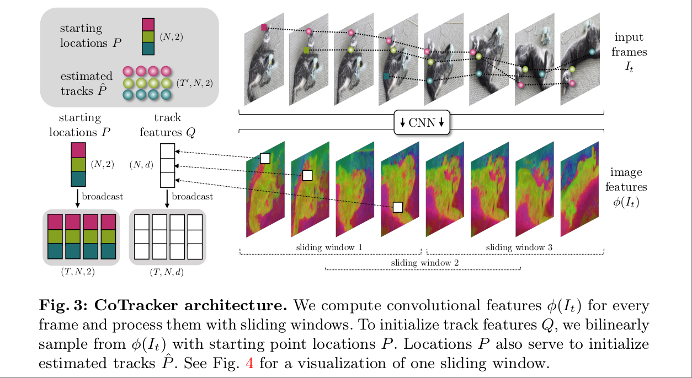
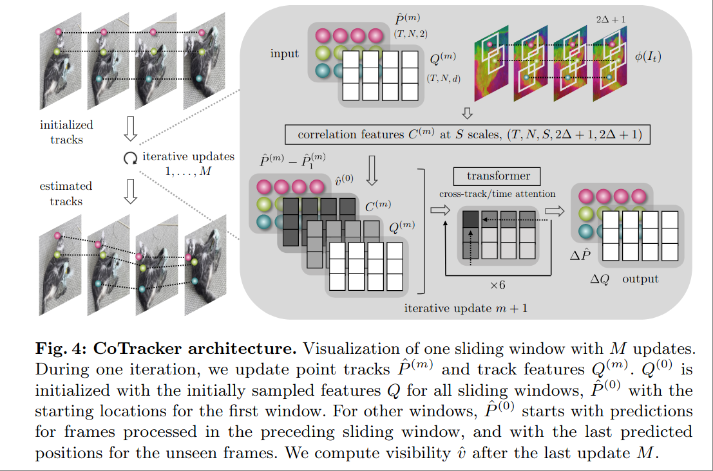

# CoTracker: It is Better to Track Together

VGGT 的基础工作，VGGT 的 Tracking Head 复用该架构。

Task:

输入 image sequence $V=(I_t)_{t=1}^T$ ，为每一帧输出N个 points track $P_t^i = (x_t^i, y_t^i), i=1...,N$ ，以及 N 个 visibility flag $v_t^i\in\{0,1\}$



## Method

Psudo Code

```
Init: Q_i,t = sample(start_frame)  (broadcast)
Loop:
  Recompute C_{t,i} from (Q_{t,i}, φ_s around P̂_{t,i})
  Transformer -> ΔP̂, ΔQ
  Update Q_{t,i} += ΔQ ; P̂_{t,i} += ΔP̂
```

### Feature Map Init

方案的核心是围绕 tracking feature $Q_t^i$ 的获取和处理。

首先通过 CNN 获取到 Feature Map $\phi(I_t)\in\mathbb{R}^{d\times\frac{H}{k}\times\frac{W}{k}}$ ，$Q_t^i$ 的初始值从中按照 query point 位置线性插值得到。

另外，对于 $t>1$ 的帧，其 $Q_t^i$ 则用第一帧的 $Q_1^i$ 初始化。这是因为任务是寻找第一帧中的这 N 个 query point 在其他帧的位置。

### Iteration

然后开始迭代，迭代的最终目标是得到 N 个点在每一帧中的位置 $\hat{P}_t^i\in\mathbb{R}^2$ ，该位置的初始估计即为输入 $P_1^i$ ，即在第一帧中的位置是不迭代修改的。

迭代过程中会不断更新三个值 

- $\hat{P}_t^i$ ，point $i$ 在 frame $t$ 上的位置。该位置的分辨率通常和 feature map 不一样，在使用位置提取特征的时候一般要用 $\hat{P}_t^i/ks$
- $Q_t^i$ , tracking feature，用来描述 tracking point 的外观特征。模型使用 Transformer 来输出每一步需要更新的 $\Delta Q$ 。需要注意的是 $Q$ 的更新过程是完全 learnable 的，而不是简单的用新的 $\hat{P}_t^i$ 反复插值得到。换句话说， $Q_t^i$ 描述的是点 $P_1^i$ 在第 $t$ 帧在当前 step 的 tracking 情况：是不是找到了？还看不看得见？如果没找到那应该去哪里找？
- $C_t^i$ ，Correlation Feature，可以看作是辅助 $Q_t^i$ 在一个 window 范围内查找点的位置。

### Correlation Feature

Correlation Feature 的计算参考了 2020 ECCV Raft: Recurrent all-pairs field transforms for optical flow，借用 RAFT 论文里的图：


本质上是一个 position to position correlattion，只不过在这里，position 在每次迭代的时候只考虑一个小的 sliding window 范围内 $\hat{P}_t^i/ks+\delta$

这里的 $ks, s = 1,...,S$ 是不同 scale 的 stride，对应了不同 scale 的 feature map $\phi_s(I_t)\in\mathbb{R}^{d\times\frac{H}{k2^{s-1}}\times\frac{W}{k2^{s-1}}}$ 。

$\delta\in\mathbb{Z}^2$ 是 window 的范围，这里 $\lVert \delta \rVert\leq \Delta$。

对每一个位置 $P_t^i$ ，所有不同 scale，不同 stride 组成的位置有 

$$\hat{P}_t^i/ks+\delta$$

其中包含了 $(2\Delta +1) ^2 S$ 个不同的位置，实际 $S=4, \Delta=3$ ，位置数量为 196

取这 196 个位置的 $\phi_s(I_t)$ ，和当前的 $Q_t^i$ 做内积，每个位置得到一个数值，把 这些数值拼起来，就得到了 196 维的 Correlation Feature $C_t^i$

$$
[C_t^i]_{s\delta} = \langle Q_t^i,\phi_s(I_t)[\hat{P}_t^i/ks+\delta]\rangle
$$

### Transformer



在迭代的每一步都是由一个 Transformer 进行，Transformer 输入 $G=(\hat{P},Q,C)$ ，把每个位置的这两个向量拼起来得到一个 token 作为输入，输出 $O(\Delta \hat{P}, \Delta Q)$ 。这实际上就是一个很标准的输出残差的 Transformer，只是会额外添加一个 Correlation Feature 来辅助。Correlation Feature 和其他 Feature 的区别是不会由残差更新，而是每个 step 重新计算。

另外对 token 添加一个特殊的位置编码，这个位置编码包含了 $t=1$ 的位置，$t$ 帧当前估计位置，和 $t$ 帧和 $1$ 帧之间的相对位置。

$\hat{v}$ 也不会更新 (和文章图里描述不一致)，它并不是 token 的一部分，而是最后一次迭代直接输出 $\hat{v}^M = \sigma(WQ^{(m)})$ ，这里的 $\sigma$ 是 sigmoid，而 $W$ 是单个 Linear Layer。


### 方案总结

如果回过头来看整个方案，迭代过程中的核心 $Q$ 并没有直接作为输出，并且也没有直接的 learning target 来学习 $Q$ ，$Q$ feature 在迭代过程中更接近于一个 learnable register token ，或者说 conditioned register token。
