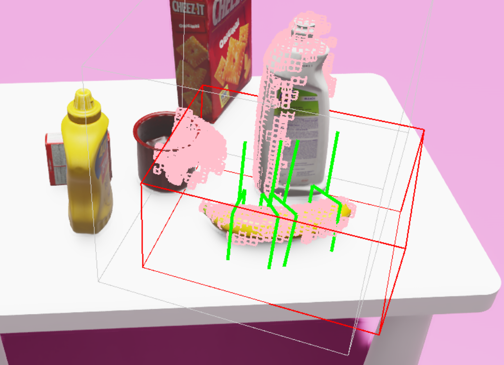
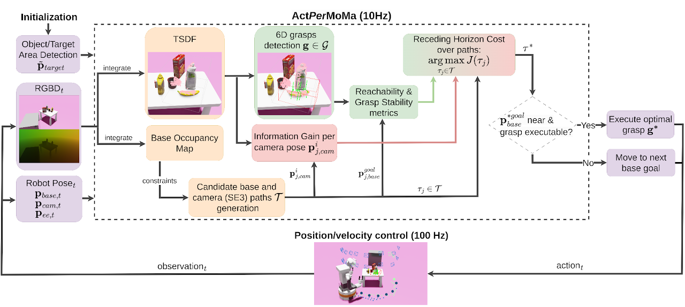
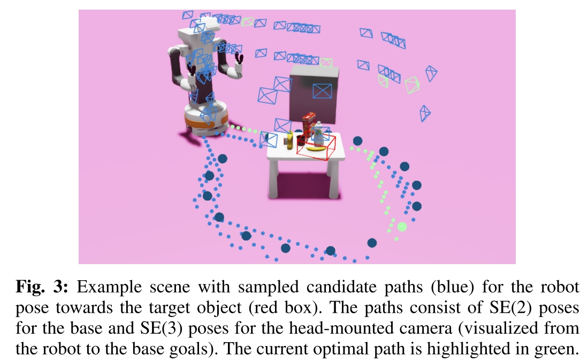

# ActPerMoMa: Active Perceptive Motion Generation for Mobile Manipulation

- [webpage](https://sites.google.com/view/actpermoma/home)

Snehal Jauhri*, Sophie Lueth*, and Georgia Chalvatzaki

TASK：在未知的环境中，通过 Action Perception 来做 Manipulation (Pick Target Object)。

核心是用 Information Gain 和 Grasp Success 作为目标，对采样到的路径进行选择。

任务设定和总体流程：
- 机器人放到一个完全未知的环境中
- 机器人的身体上固定有 vision sensor
- 目标物体处在环境中某个很杂乱的 surface 上
- 
- 可能会有额外的 instruction 说明物体的位置，例如“Pick up the object at the right corner of the table”
- 机器人探索整个环境，直到 detact 到目标物体。
- 在这个过程中，场景信息以 volumetric representation (TSDF) 表示。
- 机器人会 encode voxel information
- 移动到 informative voxel 并执行 manipulation 动作
- 

局限性：
- 要求识别到物体之后，能够持续观察到物体。
- 有很强的先验要求，object detection 以及之前的过程都是 initialization 的一部分，算法不关心。
- 实际上没有一个 explore policy，实际的 planner 只在已经观察到物体之后发挥作用。
- 每一个 step 都是完整的 replan 来保证适应新获得的信息，信息的 fusion 是通过更新 TSDF 来完成的。
- Information Gain 依然只与重建完整性有关。

## Problem Statement

Agent 的 Action Space 为
- Mobile Base $p_{base}\in SE(2)$
- Camera Pose $p_{cam} \in SE(3)$
- EEF Pose $p_{ee} \in SE(3)$

也就是说没有用一个 whole body joint configuration space，而是分成了多个 cartesian space。

文章首先 **假设** 对环境有一个粗略理解，一个目标物体所在区域的粗略 bounding box。之所以说这是一个 **假设**，是因为这个信息的获取并不是本文核心算法（下图）的一部分，而只是 Initialization 的部分。

本文的算法主要考虑了下面几个问题
- Agent 需要基于当前的 partial information 来对 exploration (scene understanding) 和 exploitation (executing a task-oriented action) 进行 trade-off
- 场景信息是持续获取的，所以控制策略本身得是基于持续获取的信息来 adaptive, reactive 进行。这期间的 cost 也是在每一步操作都更新
- 需要同时平衡多个目标：机器人移动，information gain，likelihood of grasp success
- 抓取模块需要考虑抓取位姿的可达性。

Metrics:
- total distance traveled
- viewpoints visited
- number of failures

## Method

### Pipeline

1. Initialization: Robot 采集 RGBD，生成场景的 TSDF，用视觉模型 detact 到 object，把 object 中心 $\tilde{p}_{target}$ 一定范围内的 bounding box 作为目标区域。这个过程都不是算法核心，文章方案把这一部分作为先验使用。
2. FOR EACH TIME STEP
   1. 在 $\tilde{p}_{target}$ 一定半径范围内采样 $N_b$ 个 collision free base position $\{p_{base}^{goal_i}\}_{i=0}^{N_b}$。
   2. 对每个 base pose 采样一个 camera pose，这个 camera pose 是一个看向物体中心 $\tilde{p}_{target}$ 的 pose。这样就得到了 $N_b$ 个 goal candidates $\{p_{base}^{goal_i}, p_{cam}^{goal_i}\}_{i=0}^{N_b}$
   3. 对每个 goal candidate，在 discretized grid 上用 $A^*$ 得到 M 条到达目标的轨迹 $\mathcal{T}=\{\tau_j\}_{j=0}^M$，每条 path 的形式都是 $\tau=\left\{ \{p_{base}^{0}, p_{cam}^{0}\} , \{p_{base}^{1}, p_{cam}^{1}\}...\{p_{base}^{goal}, p_{cam}^{goal}\}\right\}$
   4. 
   5. 从 M 个 path 里选取 **optimal** path，从 optimal path 里选择第一个 waypoint，插值得到 action 并执行。对下一个 step 2.i,ii,iii,iv,v 都需要重新 plan

Optimal path 定义

$$\tau^* = \argmax_{\tau\in\mathcal{T}} J_{IG}(o_{TSDF}, \tau) + J_{exec}(\mathcal{G}, \tau)$$

### $J_{IG}(o_{TSDF}, \tau), J_{exec}(\mathcal{G}, \tau)$

Information Gain 的定义和 [2016 ICRA An Information Gain Formulation for Active Volumetric 3D Reconstruction](./[2016%20ICRA]%20An%20Information%20Gain%20Formulation%20for%20Active%20Volumetric%203D%20Reconstruction.md) 十分类似，是一个 rear-side voxel information gain $IG_{rear}$

- 对每个 camera view $p_{cam}\in SE(3)$，对 rear side TSDF voxels 进行计数。这里的 rear side 指的是 observed occupied voxel 和 unknown voxel 之间的边界，TSDF 只考虑前面提到的先验的 bounding box 内的 TSDF。
- $IG_{rear}$ 不仅仅对最终的 $p_{cam}^{goal}$ 来计算，而是会对 $\tau_j$ 上的所有 $\{p_{cam}^k\}$ 都计算 $IG_{rear}$。
- 在每个 time step 都用当前的 TSDF 来算 grasp pose。Grasp pose 由现成 network 给出，对 grasp 的衡量由 score from network, stability between timestep, reachability 决定。

$J_{IG}(o_{TSDF}, \tau), J_{exec}(\mathcal{G}, \tau)$ 的定义总结如下

$$J_{IG}(o_{TSDF},\tau) = \sum_{p_{cam}\in \tau}\frac{IG_{rear}(o_{TSDF}, p_{cam})}{dist(p_{cam})^2}$$

$$J_{exec}(\mathcal{G}, \tau) = \frac{\max_{g\in \mathcal{G}}\mathcal{R}(g,p_{base}^{goal})}{len(\tau)}$$
