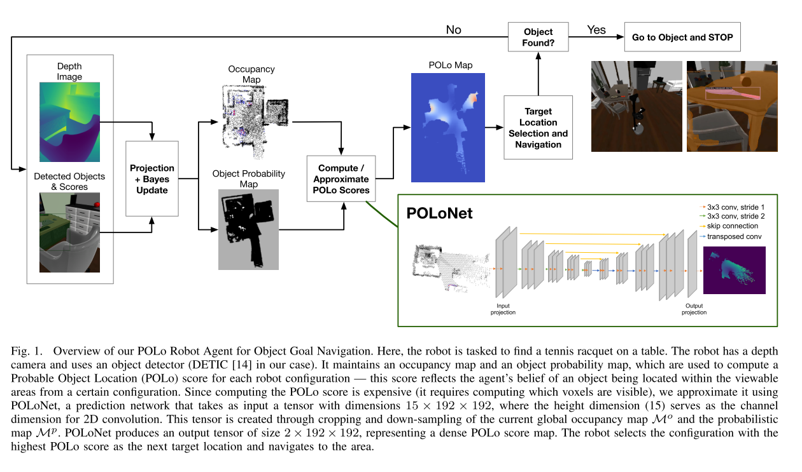

# Probable Object Location (POLo) Score Estimation for Efficient Object Goal Navigation
POLo Paper. 本文提及的 related work 很多有进一步读的价值。

Task:
Object Search in unexplored environment. 本文聚焦的是 Object Search 中的 Explore 部分，通过 explicit datastructure 辅助，快速完成对环境的探索。

Env:
Robot 是一个 2D Navigation Robot，Observation 包括 RGBD 图片和 Localization of Robot. Action Space 是离散的前进左右转停止。

## Method
Basic Idea: 用一个 heuristic score 来引导 agent 去探索物体可能出现的区域和未探索区域，这个 score 有明确的定义，可以从 explicit map 中计算得到。另外可以用 data-driven 的方式用 differential neural network 来拟合这个 heuristic score.

Probable Object Location (POLo) score.

