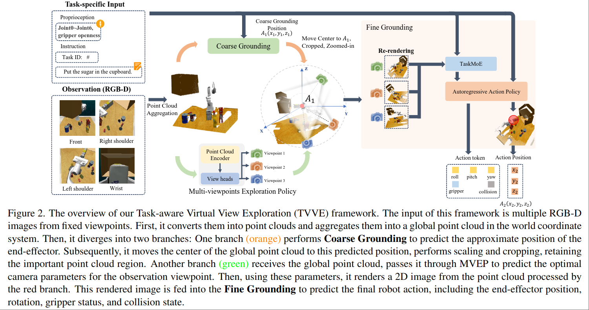
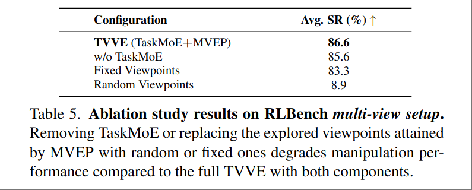

# Learning to See and Act: Task-Aware Virtual View Exploration for Robotic Manipulation

写得有点烂。

[page](https://hcplab-sysu.github.io/TAVP/)

用新渲染的虚拟的视角来做 VLA。希望在混乱的有遮挡的环境下执行 Manipulation 任务。

文章把方案称之为 Task-aware Virtual View Exploration （TVVE）, 粗略的流程大概是

- 输入多张第三视角的、固定的、RGBD相机的图像，这几个相机的姿态已知。
- Point Cloud Reconstruction。
- 使用重建出来的 Point Cloud 和 Wrist Camera 的 RGBD 图像，估计 End-Effector 位置，将 Point Cloud 裁剪、移动到 EEF 位置。
- 训一个 RL Policy，输入第三视角图像，输出一个最佳视角。
- 用重建的 Point Cloud 渲染一张最佳视角下的图像，然后做 VLA。

## TaskMoE

文章先用输入的第三人称图像直接作为 Vision Input 训练一个 MoE VLA，架构和方法直接用了 [RVT2](https://github.com/NVlabs/RVT)。

## Multi-Viewpoint Exploration Policy

输入 Point Map 和 RGB Image $X=\text{Concat}(\mathcal{P},F_{img}) \in \mathbb{R}^{N\times 6}$ ，用一个 MLP 输入 K 个新的 camera pose。相机姿态用 lookat 和 pitch yaw 5个参数来表示，并且有 MLP 输出其 mean and variance。

训练采用 PPO，reward 有三部分

$r_0$: VLA 的正确性，把新 camera pose 渲染出来扔进 VLA，取 VLA 的 Loss。区别在于此时会将上一个阶段训练的固定视角 VLA 作为一个 baseline，reward 只要求不比 baseline 差。个人感觉用一个巨大的 VLA 作为 reward model，对训练这里的 MLP 的指导作用估计会很差。

$r_1$: Reconstruction Loss。理论上是降低 Height Map 的不确定性，但实际定义和做法没看懂。 

> we incorporate a confidence-based reward derived from the fine grounding module. Specifically, we compute the negative average entropy across the grounding heatmaps
> $$r_1=-\frac{1}{K}\sum_{i=1}^K\mathcal{H}(\text{softmax}(H_i))$$

$r_2$: viewpoint diversity. 要求输出的 K 个视角尽量不同。

$$
r_2 = \frac{1}{K(K-1)}\sum_{i\neq j} (1-cos(p_i, p_j))
$$

训练过程中还会使用生成的虚拟视角对 VLA 模型进行微调。

## Experiment

仿真用 CoppeliaSim，有真机实验。

从 Ablation 的结果来看，没啥用。或者说本文的任务和视角限制关系不大，动态视角只提升了1个点，再考虑到动态视角训练之后还有微调过程，这1个点和动态视角之间的关系基本可以说等于没有。
