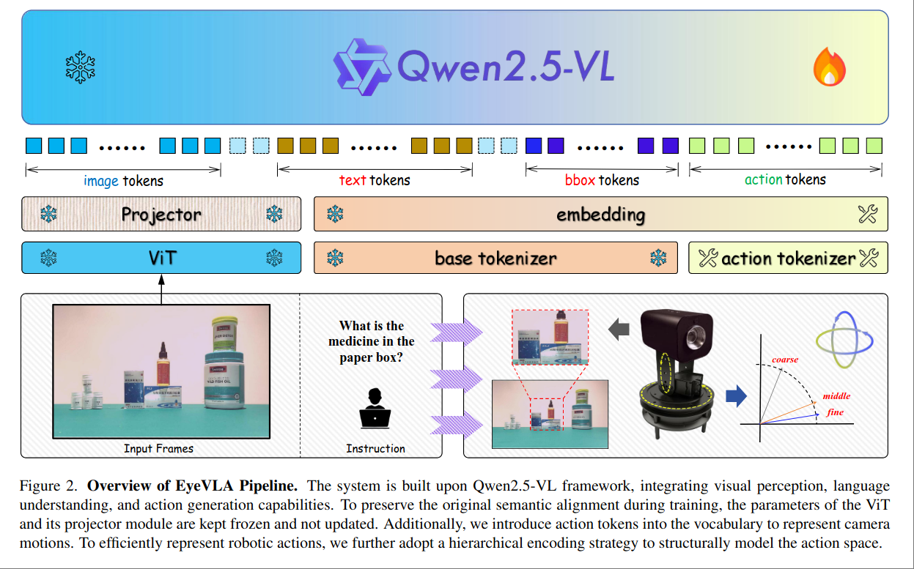

# Look, Zoom, Understand: The Robotic Eyeball for Embodied Perception

一个可以缩放和旋转的 Active Perception Agent.

输入时一张图像和一个问题，然后微调 VLM 输出一个 action $\Delta \theta_1, \Delta \theta_2, \Delta \text{zoom}$

本文的核心设计是对 action token 进行了简化，用固定数量的数字来作为 output token。

NEED FURTHER READING