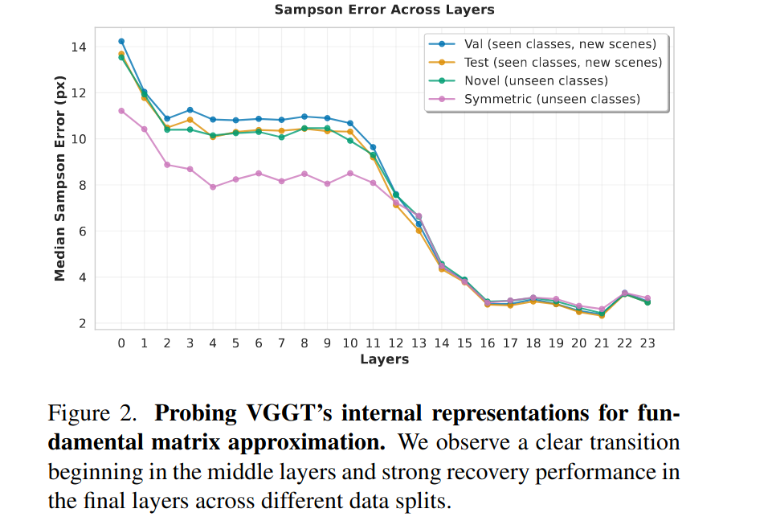
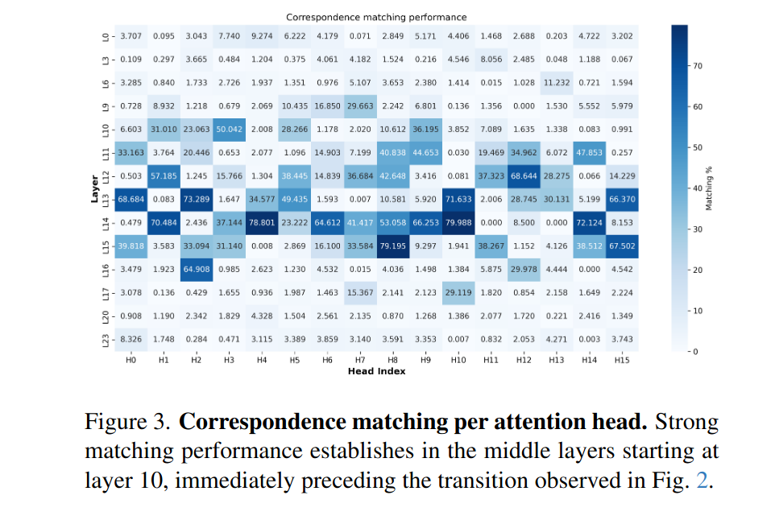
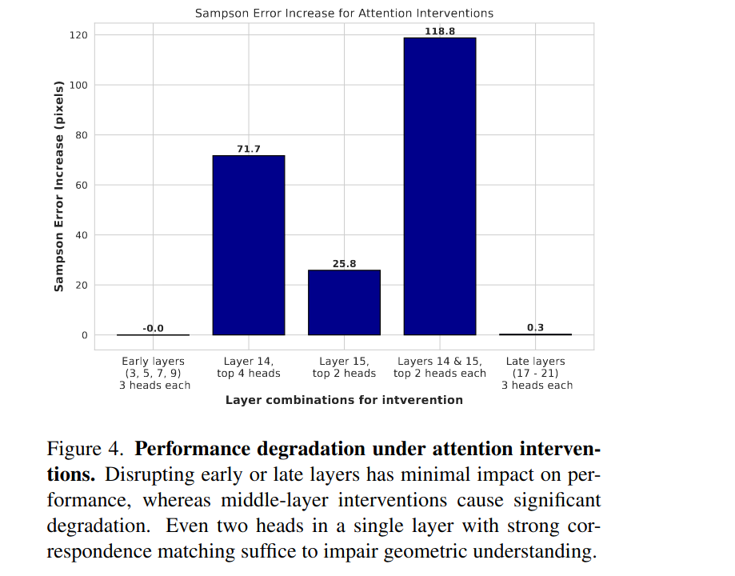
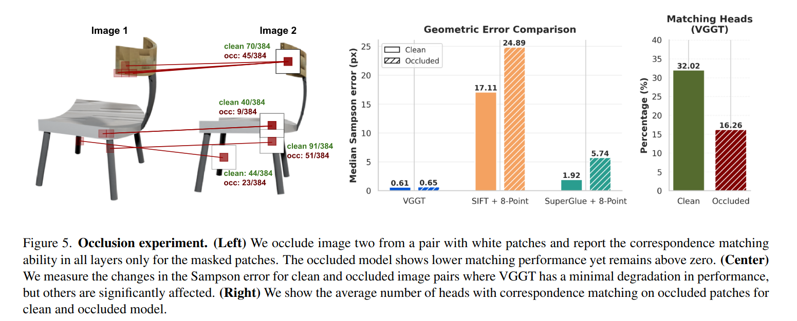
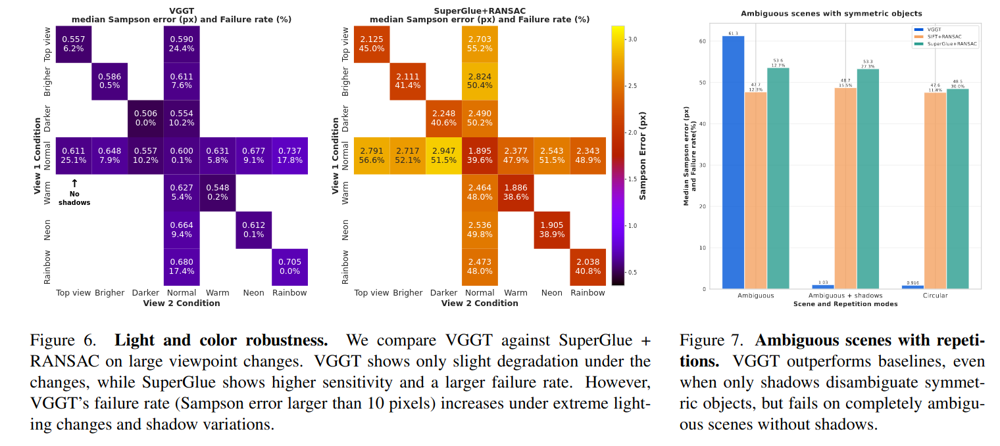
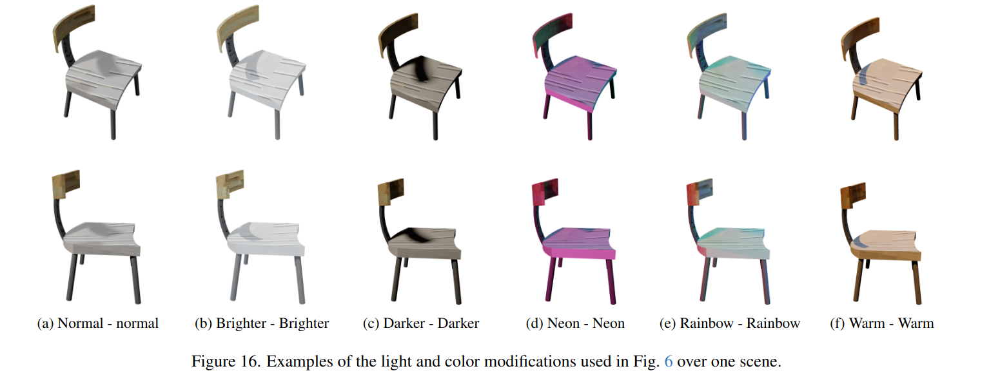

# On Geometric Understanding and Learned Data Priors in VGGT

[VGGT](./[2025%20CVPR]%20VGGT%20Visual%20Geometry%20Grounded%20Transformer.md) 的可解释性研究。其最核心的结论是 VGGT 极强的泛化和多帧 Grounding 能力和它 Point Track 能力的强关联，和它建模对极几何（Epipolar geometry）的能力强关联。

本文主要的 probing 方法是基于对对极几何中的基础矩阵 Fundamental Matrix (3x3) 的估计，该矩阵描述两个视角拍摄同一图像的约束关系。假设第一张图中的某像素2D齐次坐标 $x=[u, v, 1]$ ，第二张图像中同一点为 $x'$ ，基础矩阵满足

$$
x'^TFx=0
$$

其中 $l'=Fx$ 或者 $x'^Tl'=0$ 称为极线，即像素 x 的3D射线在第二张图中的投影。VGGT 并没有显式的将对极几何作为训练目标，但是可以从结果中计算出 Fundamental Matrix。对于静态的、无畸变的、包含平移的两张图像，其所有像素之间的对极几何约束可以有一个相同的基础矩阵描述。这和 VGGT 应用时的 limitation 非常接近。

本文的基本结论是

1. 基础矩阵 Fundamental Matrix 可以从 VGGT 的中间层 representation 中恢复出来。
2. 对 Fundamental Matrix 的重建能力，或者说对对极几何的建模能力，是在模型中间层逐渐构建出来的。
3. VGGT 对于各种复杂数据都能构建这种具有强对极几何表征能力的 representation，这为其带来了极强的泛化能力。

## VGGT 如何获得几何理解能力

### Does VGGT encode geometry? If so, where?

文章直接使用 24个 两层的 MLP 来从 VGGT 每一层的 camera token 中预测 fundamental matrix $F$ ，使用的 loss function 为 squared Sampson distance，这是 structure from motion 研究中常用的 loss

$$
d_s^2 = \frac{(\mathbf{x}'^{\top} F \mathbf{x})^2}
{(F \mathbf{x})_1^2 + (F \mathbf{x})_2^2 + (F^{\top} \mathbf{x}')_1^2 + (F^{\top} \mathbf{x}')_2^2}
$$

得到的结果如下

可以认为 VGGT 的中间几个特定层着重负责理解对极几何约束，且在层与层之间不断地精细化结果。

### How do attention maps encode correspondences?

本文希望进一步探索上述对对极几何的建模能力是如何通过 attention 获得的。

为此本文直接分析 Query 和 Key ，或者说 attention score。即，在哪些层的 attention score 大小和位置的对应关系一致。

分析方法是计算 attention score，然后对于每一个 source image 中的 image patch token，计算它对于 target image 中 patch token 的 attention score，然后找 score 最高的那个 target patch token，看看这个 token 是不是对应的相同 3D 位置的 patch。如果有多个 target image，那就每个 target image 都判断一下。

对于每一个 source token，只要找到一个 target image 中对应的 patch 是正确的，就记 SUCCESS ，然后计算所有 source tokens 的 success matching rate 得到了下图

这个结果和上一个实验是一致的，即在特定的中间层（10~16）的 attention 主要是在构建对极几何关系。

### Do these attention patterns play a causal role?

这部分探讨 VGGT 这种直接关注 patch 映射关系的 attention 模式是不是获得对极几何理解能力的原因。

为了验证这一点，本文使用 attention knockout 注意力剔除。即有选择性的屏蔽一些 attention，看看是否会产生影响。

本文的做法是，在训练 Fundamental Matrix Recover Model 的时候，关闭特定 layer 特定 head 的 attention。head 根据其在上一个实验中的 correspondences 预测准确率选择最高的几个。

剔除之后再看重建 Fundamental Matrix 的 Error 有什么变化，得到结果如下

- 剔除前几层没什么影响，可以理解，因为本来这时候对极几何关系也没有被 VGGT 理解到。
- 剔除中间基层影响巨大，几乎是从可以做到变成完全做不到，这说明了中间几层的 attention 过程确实是理解对极几何的关键。
- 剔除后面几层影响不大，即后续几层在 attention partern 和对极几何映射关系没啥关联性的情况下，确实删掉 attention 对重建结果影响不大。

结论便是 VGGT 中间层这种关注 point correspondence 的注意力模式和对极几何理解能力之间存在因果关系。

## VGGT 能力的边界在哪里

### 对遮挡的处理能力

简单说尽管遮挡一定程度降低了前面实验中 correspindence matching 的成功率，但是即使 patch 已经被遮挡了，还是可以有很多 matching 成功，说明 VGGT 一定程度上重建了这些遮挡区域的 patch 映射关系。

在最终结果上影响非常小，即对遮挡的鲁棒性很高。

### 对图像扰动的适应能力

当输入 VGGT 的多张图像互相之间有不同的模糊程度、相机参数、光照情况的时候，检验其是否能应对这些扰动。

左边两张图的含义

- 横坐标和纵坐标是添加扰动的方式
- 数值代表 error distance，越低越好。
- 左图是 VGGT，右图是传统方法。

左图的扰动效果如下所示

简单说 VGGT 对于各种扰动，其效果下降都优先，或者说都依然能输出 make sense 的结果，而这些扰动对于传统方法来说无法处理。

右图的含义

- 把同一个物体的多个模型摆一圈，然后看3D理解效果。
- 数值越低越好
- 三组柱状图从左到右分别代表
    - 把第二个视角模糊掉，且去掉阴影。此时 VGGT 也无法处理。
    - 把第二个视角模糊掉，但是保留阴影。此时 VGGT 可以从阴影中重建出 Geometry。
    - 单纯的多个同模型摆一圈，此时传统方法由于其对视觉特征的依赖性，已经无法处理。

这部分实验也希望证明，VGGT 对3D几何的理解是通过其学习到的各种 prior 做到的，而不是通过简单的通过视觉上的特征得到的。
