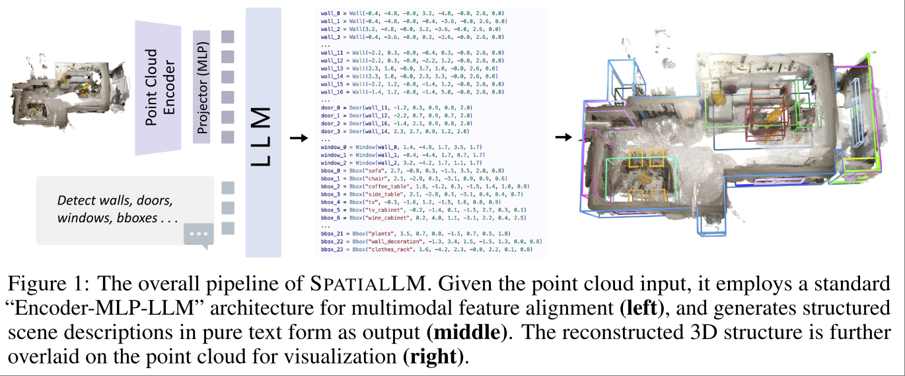
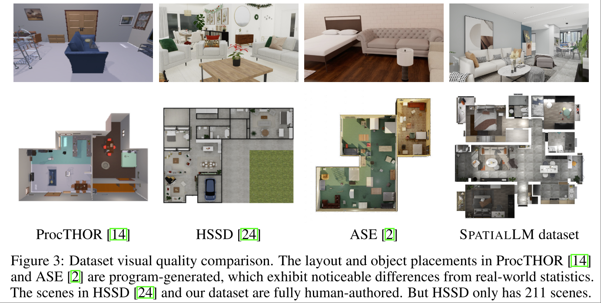
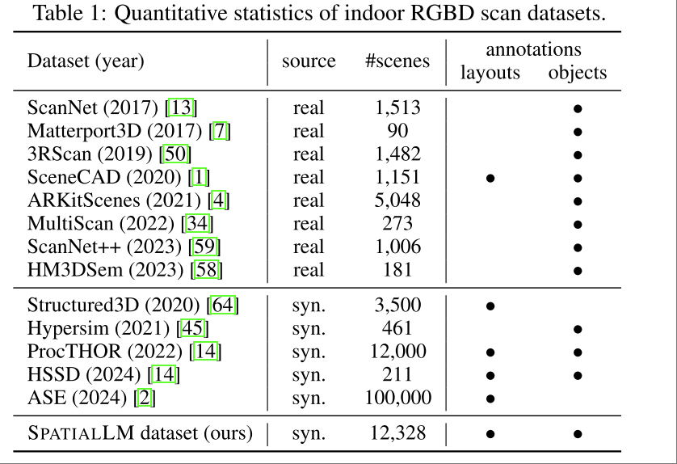
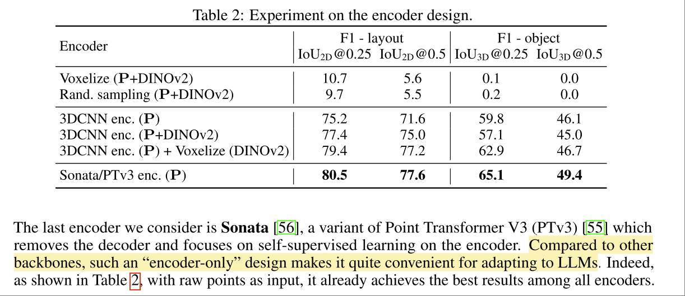

# SpatialLM: Training Large Language Models for Structured Indoor Modeling

[Website](https://manycore-research.github.io/SpatialLM/)

用大模型直接处理 pointcloud ，输出类别，bbox，label。

为了训练这个模型，文章使用了大量室内 RGBD 数据集。12,328 indoor scenes (54,778 rooms) with groundtruth 3D annotations。

另外本文也是比较典型的用现有大模型训练一个新任务（而不是简单的同任务不同distribution）的工作，其训练方式非常值得研究。

## Basic Idea

直接微调开源 LLM 来做训练。

“Encoder-MLP-LLM” architecture for multimodal feature alignment. 即用 Encoder+MLP 将新的模态的数据投到 LLM 的模态，其他交由 LLM 微调。

## Data

为了能够得到适合的数据，文章使用了室内设计在线平台的室内设计方案库，从中筛选出了 12,328 indoor scenes (54,778 rooms)。对于出了墙壁地板门窗之外的物品，文章只保留了59类物品，将所有尺寸 < 15cm 的小物品都筛选掉，最后的数据集中包含 412,932 annotated object instances of 35,426 unique CAD models。

在得到3D数据之后，将其通过工业级的渲染引擎渲染成真实度较高的 RGBD 图像。

**很遗憾数据集没有开源，甚至没有给出室内设计数据库**

下图是文章将其构建的数据集和几个室内仿真数据集渲染效果的对比

下图是数据规模的对比

## Model Architecture

PointCloud Encoder 使用 Sonata，也是 2025CVPR 的 highlight。

本文也对比了使用各类基于 DINO + Projection 的 Encoder，但是效果上是 Sonata 最好。

LLM 部分则使用了 Qwen, Llama 两类模型，似乎没有对比效果区别。