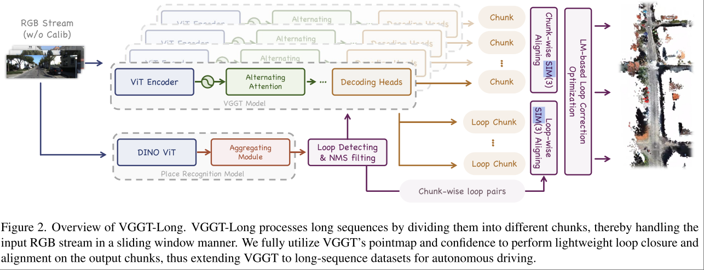

# VGGT-Long: Chunk it, Loop it, Align it – Pushing VGGT’s Limits on Kilometer-scale Long RGB Sequences

[github](https://github.com/DengKaiCQ/VGGT-Long)

用 VGGT 来做长时间大范围的 SLAM，核心思路就是将 VGGT 多次调用的结果进行对齐。最终得到的效果非常惊艳。

## Method

输入 Image Sequence $\mathcal{I} = \{I_1, ..., I_N \}$ 。

将其划分成互相有重叠的 K 个 chunks ，每个 chunk 长度为 L ，但是有 O 个图片与上一个 chunk 重叠。

每个 chunk $\mathcal{C}_k$ 由 VGGT 单独处理，输出对应的 camera pose, 计算来的 point map $P_k \in \mathbb{R}^{H\times W\times 3}$ , 以及 confidence map $c_k\in \mathbb{R}^{H\times W}$。

### Chunk-wise SIM(3) Aligning

给出两个相邻的 chunks $\mathcal{C}_k, \mathcal{C}_{k+1}$ ，目标是找到他们之间的 SIM(3) tramsformation，即 SE(3) + 缩放。

$$
S_{k,k+1}^* = \argmin_{S\in \text{Sim}(3)} \sum_i \rho \left( \lVert p_k^i - Sp_{k+1}^i \rVert _2 \right)
$$

$\rho(\cdot)$ 是 Huber Loss Function，一种对异常值更不敏感的 Loss。

本文通过求解 Iteratively
Reweighted Least Squares (IRLS) optimization 来解决上述问题，求解过程中迭代最小化以下 weighted sum of squared error

$$
S^{(t+1)} = \argmin_{S\in \text{Sim}(3)} \sum_i w_i^{(t)}  \lVert p_k^i - Sp_{k+1}^i \rVert _2^2
$$

其中

$$
w_i^{(t)} = c_i \cdot \frac{\rho'(r_i^{(t)})}{r_i^{(t)}} \\
r_i^{(t)} = \lVert p_k^i - S^{(t)}p_{k+1}^i \rVert _2
$$

简答说，就是用 confidence map 作为 weight，后面的部分是 IRLS 算法的设计，将残差作为权重。confidence map 除了作为 map，置信度低于 chunk 中位数置信度 * 0.1 的点会被直接丢掉。

### Loop Detection and Loop-wise SIM(3) Aligning

